# ELF

## 1. ELF格式文件类型

|            ELF文件类型             | 说明                                                         | 实例                             |
| :--------------------------------: | ------------------------------------------------------------ | :------------------------------- |
|  可重定位文件（Relocatable File）  | 这类文件包含了代码与数据，可以被用来链接 成可执行文件或共享目标文件，静态链接库也 可以归为这一类 | Linux的.o Windows的.obj     |
|   可执行文件（Executable File）    | 这类文件包含了可直接执行的程序，它的代表就是 ELF可执行文件，它们一般都没有扩展名 | /bin/bash文件 Windows的.exe |
| 共享目标文件（Shared Object File） |                                                              | Linux的.so， Windows的.dll  |
|   核心转储文件（Core Dump File）   |                                                              | Linux下的core dump               |

## 2. 目标文件（.o）结构

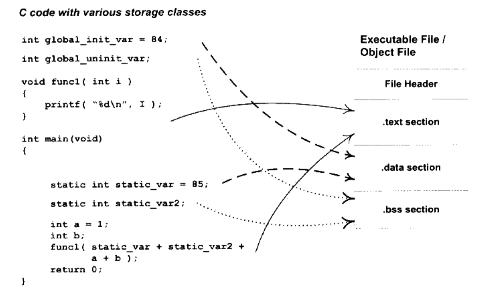

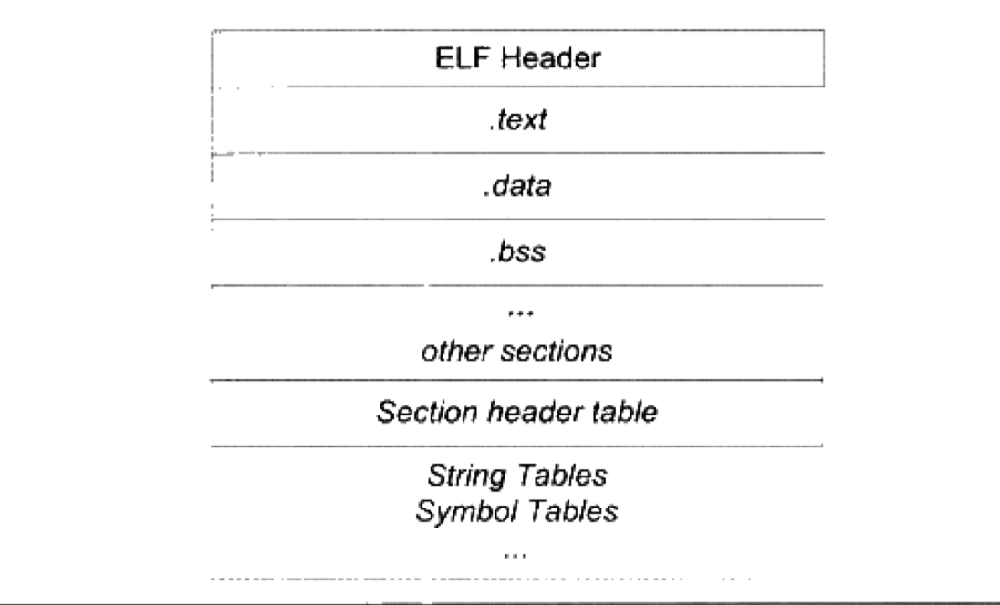

+   **`ELF文件头`**：描述整个文件的基本属性，例如ELF文件版本、目标机器型号、程序入口地址等
+   **`各个ELF Section`**
+   **`段表（Section header table）`**：描述了ELF文件包含的所有段的信息，比如每个段的段名、段的长度、在文件中的偏移、读写权限及段的其它属性。
+   **`字符串表`**
+   **`符号表`**

### 2.1 文件头

>   包含**`ELF魔数`**、**`文件机器字节长度`**、**`数据存储方式`**、**`版本`**、**`运行平台`**、**`ABI版本`**、**`ELF重定位类型`**、**`硬件平台`**、**`硬件平台版本`**、**`入口地址`**、**`程序头入口和长度`**、**`段表位置和长度`**、**`段数量`**等

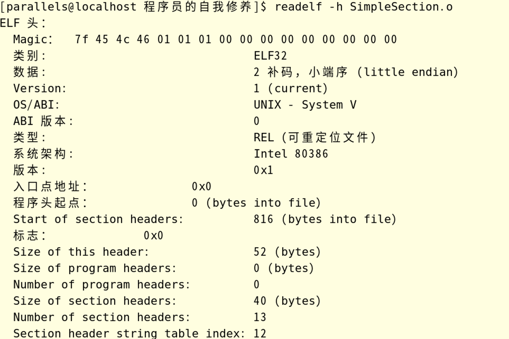

对应结构定义：*`/usr/include/elf.h`*中的**`struct Elf32_Ehdr`**

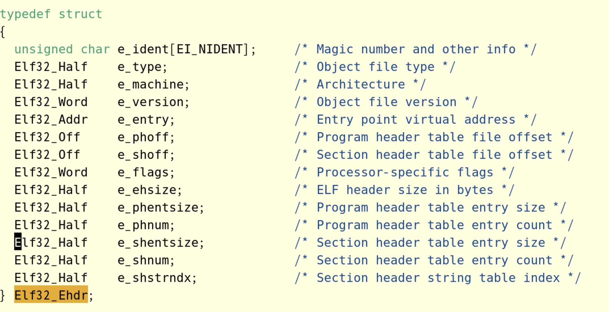

### 2.2 段表

`段表`描述了ELF的各个段的信息，比如每个段的段名、段的长度、在文件中的偏移、读写权限以及段的其它属性。段表在ELF文件中的位置由ELF文件头的**`e_shoff`**成员决定。

`objdump -h`命令只是将ELF文件中关键的段显示出来，而省略了其它辅助性的段，比如：符号表、字符串表、段名字符串表、重定位表等。可以使用`readelf`工具来查看ELF文件的段，它显示的结果才是真正的段表结构：

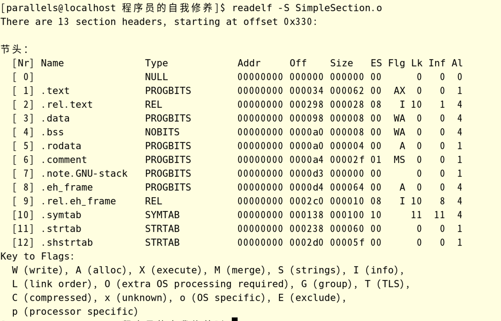

#### 2.2.1 Elf32_Shdr 结构体

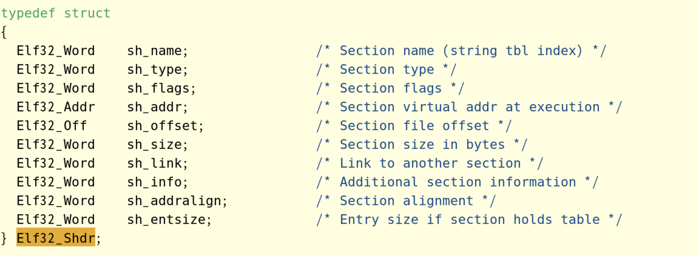

+   **`sh_name`**：段名，段名字符串在`.shstrtab`中的偏移

+   **`sh_type`**：段类型

    +   SHT_NULL - 0 - 无效段
    +   SHT_PROGBIT - 1 - 程序段、代码段、数据段都是这个类型
    +   SHT_SYMTAB - 2 - 符号表
    +   SHT_STRTAB - 3 - 字符串表
    +   SHT_RELA - 4 - 重定位表
    +   SHT_HASH - 5 - 符号表的哈希表
    +   SHT_DYNAMIC - 6 - 动态链接信息
    +   SHT_NOTE - 7 - 提示性信息
    +   SHT_NOBITS - 8 - 该段在文件中没有内容，如`.bss`段
    +   SHT_REL - 9 - 该段包含了重定位信息
    +   SHT_LIB -10 - 保留
    +   SHT_DYNSYM - 11 - 动态链接的符号表

+   **`sh_flags`**：段的标志位

    +   SHF_WRITE - 1 - 段在进程空间中可写
    +   SHF_ALLOC - 2 - 段在进程空间中需要分配空间
    +   SHF_EXECINSTR - 4 - 段在进程空间可以被执行，一般指代码段

+   **`sh_link + sh_info`**：段的链接信息，如果段的类型是与链接相关的（不论是动态链接还是静态链接），比如重定位表、符号表等，那么`sh_link`和`sh_info`这两个成员包含的意义如下。对于其它段，没有意义。

    | sh_type     | sh_link                            | sh_info                            |
    | ----------- | ---------------------------------- | ---------------------------------- |
    | SHT_DYNAMIC | 该段所使用的字符串表在段表中的下标 | 0                                  |
    | SHT_HASH    | 该段所使用的符号表在段表中的下标   | 0                                  |
    | SHT_REL     | 该段所使用的符号表在段表中的下标   | 该重定位表所作用的段在段表中的下标 |
    | SHT_RELA    | 同上                               | 同上                               |
    | SHT_SYMTAB  | 操作系统相关                       | 操作系统相关                       |
    | SHT_DYNSYM  | 同上                               | 同上                               |
    | other       | SHN_UNDEF                          | 0                                  |

    

### 2.3 重定位表

一个重定位表同时也是ELF的一个段，那么这个段的类型（sh_type）就是"SHT_REL"类型，它的"sh_link"表示符号表的下标，它的"sh_info"表示它作用于哪个段。比如".rel.text"作用于".text"段，而".text"段的下标为1，那么".rel.text"的"sh_info"为"1"。

重定位表是静态链接的核心，所以到静态链接部分再整理重定位表。

### 2.4 字符串表

示例：

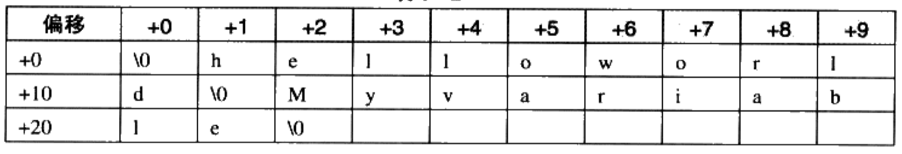

则偏移与它们对应的字符串如下：

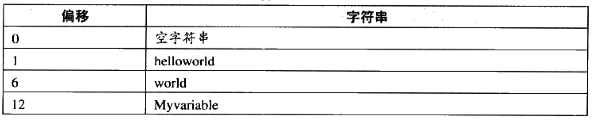

常见的ELF文件中的字符串表存放在两个段中`.strtab`和`.shstrtab`，分别代表"字符串表（String Table）"、"段表字符串表（Section Header String Table）"。

### 2.5 符号 -- 链接的接口

在链接中，目标文件之间相互拼合实际上是目标文件之间对地址的引用，即对函数和变量的地址的引用。比如目标文件B要用到了目标文件A中的函数"foo"，我们就称目标文件A**`定义（Define）`**了函数"foo"，称目标文件B**`引用（Reference）`**了目标文件A中的函数"foo"。这两个概念同样适用于变量，每个函数或变量都有自己独特的名字，才能避免链接过程中不同变量和函数之间的混淆。在链接中，我们将函数和变量统称为**`符号（Symbol）`**，函数名或变量名就是**`符号名（Symbol Name）`**。

我们可以将**`符号`**看作是链接中的粘合剂，整个链接过程正是基于符号才能够正确完成。每一个目标都会有一个对应的**`符号表（Symbol Table）`**，这个表里记录了目标文件中所用到的所有符号。每个定义的符号有一个对应的值，叫做**`符号值（Symbol Value）`**，对于变量和函数来说，**`符号值就是它们的地址`**。除了函数和变量之外，还存在其它几种不常用到的符号。具体的符号分类如下：

+   定义在本目标文件中的全局符号，可以被其它目标文件引用。比如SimpleSection.o里面的"func1"、"main"等
+   在本目标文件中引用的全局符号，但没有定义在本目标文件中，这一般叫做“外部符号（External Symbol）”，也就是前面说的**`符号引用`**，例如SimpleSection.o里面的"printf"
+   段名，由编译器产生
+   局部符号，只在编译单元内部可见
+   行号信息，可选

使用"nm"查看目标文件中的符号

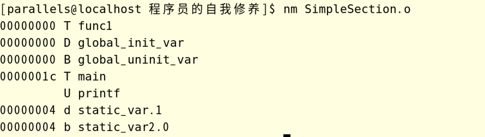

#### 2.5.1 符号表结构

ELF中的符号表是一个段，段名一般为**`.symtab`**。符号表其实是一个**`Elf32_Sym`**结构（32位ELF文件）的数组，每个**`Elf32_Sym`**结构对应一个符号。数组中的第一个元素，即下标为0的元素为无效的“未定义”符号。

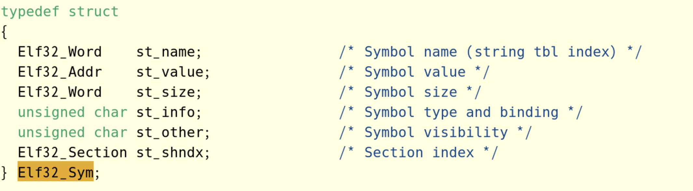

+   *`st_name`*：符号名，为符号名在字符串表中的下标
+   *`st_value`*：符号值，与符号类型有关
+   *`st_size`*：符号大小，对于数据类型符号，本值为该类型类型的大小。如一个double类型符号大小为8
+   *`st_info`*：符号类型和绑定信息
+   *`st_other`*：未使用
+   *`st_shndx`*：符号所在段

#### 2.5.2 符号类型和绑定信息 - st_info

`st_info`成员低4位表示符号的类型（Symbol Type），高28位表示符号绑定信息。

##### 2.5.2.1 符号绑定信息

+   STB_LOCAL：值0，局部符号，对于目标文件外部不可见
+   STB_GLOBAL：值1，全局符号，外部可见
+   STB_WEAK：值2，弱引用

##### 2.5.2.2 符号类型

+   STT_NOTYPE：值0，未知类型符号
+   STT_OBJECT：值1，该符号是个数据对象，比如变量、数组等
+   STT_FUNC：值2，该符号是个函数或其它可执行代码
+   STT_SECTION：值3，该符号表示一个段，这种符号必须是`STB_LOCAL`的
+   STT_FILE：值4，该符号表示文件名，一般都是目标文件所对应的源文件名，它一定是`STB_LOCAL`的，并且它的`st_shndx`一定是`SHN_ABS`

#### 2.5.3 符号所在段 - st_shndx

+   如果符号定义在本目标文件中，`st_shndx`表示符号所在段在段表中的下标

+   SHN_ABS：值0xfff1，该符号包含一个绝对值，表示文件名的符号就属于这种类型
+   SHN_COMMON：值0xff2，该符号是一个"COMMON块"类型的符号，一般来说，未初始化的全局符号定义就是这种类型的
+   SHN_UNDEF：值0，该符号未定义，

#### 2.5.4 符号值 - st_value

+   在目标文件中，如果是符号的定义并且该符号不是"COMMON"块类型的（即`st_shndx`不为"SHN_COMMON"），则**`"st_value"表示该符号在段中的偏移。`**即符号所对应的函数或变量位于`st_shndx`指定的段，偏移`st_value`的位置。`这也是目标文件中定义全局变量的符号的最常见情况，比如SimpleSection.o中的"func1"、"main"和"global_init_var"等`
+   在目标文件中，如果符号是"COMMON"块类型的（即`st_shndx`为"SHN_COMMON"），则`st_value`表示该符号的**`对齐属性`**。比如SimpleSecion.o中的"global_uninit_var"
+   在可执行文件中，`st_value`表示符号的虚拟地址。

#### 2.5.5 示例说明

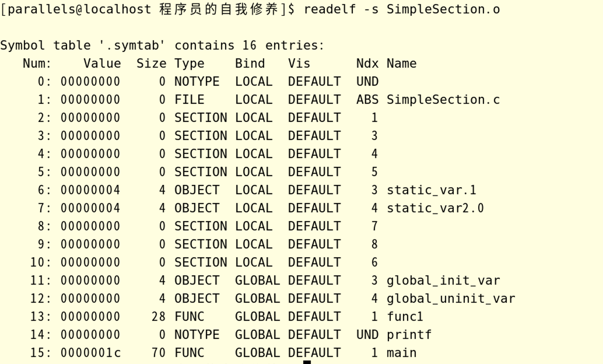

+   第一个符号，即下标为0的符号，永远都是一个未定义符号

+   `func1`和`main`函数都是定义在SimpleSection.o里面的，它们所在的位置都是代码段，所以Ndx为1，即SimpleSection.o里面".text"段的下标。它们是函数，所以类型是`STT_FUNC`。它们是全局可见的，所以是`STB_GLOBAL`。`Size`表示函数指令所占的字节数。`Value`表示函数相对于代码段起始位置的偏移量

+   `printf`这个函数不是在SimpleSection.o中的，但被引用，所以`Ndx`是`SHN_UNDEF`

+   `global_init_var`是已初始化的全局变量，它被定义在`.data`段，int类型，所以`Size`为4

+   `global_uninit_var`是未初始化的全局变量，被定义在`.bass`段，int类型，所以`Size`为4 

+   `static_var.1`和`static_var2.0`大致类似。

    >   总结一下`.data`段和`.bss`段的变量。
    >
    >   +   `global_init_var`在`.data`段，`Value`为0，`Size`为4 。即`global_init_var`在`.data`段的偏移0处开始，占用4个字节。而`static_var.1`也在`.data`段，`Size`也为4，不同之处在于`Value`为4 ，即`static_var.1`在`.data`段偏移4处开始，占用4个字节，也就是紧跟在`global_init_var`之后
    >   +   同样，根据`global_uninit_var`和`static_var2.0`的属性，可以发现`global_uninit_var`在`.bss`偏移0处，占用4字节，紧跟之后的就是`static_var2.0`，在`.bss`偏移4处，占用4字节

+   `SimpleSection.c`这个符号表示编译单元的源文件名

#### 2.5.6 链接器特殊符号

使用`ld`作为链接器来链接生产可执行文件时，它为我们定义了很多符号名，可以在程序中直接使用，这些符号称为`特殊符号`。几个具有代表性的特殊符号如下：

+   **`__executable_start`**：程序起始地址，注：不是入口地址，是程序的最开始的地址
+   **`__etext`**、**`_etext`**、**`etext`**：表示代码段结束地址
+   **`_edata`**、**`edata`**：数据段结束地址
+   **`_end`**、**`end`**：程序结束地址
+   以上地址都为程序被装载时的虚拟地址

#### 2.5.7 符号修饰与函数签名

>   是重要是理解C++中**`extern "C" {}`**的作用

#### 2.5.8 弱符号与强符号

对于C/C++语言来说，编译器默认函数与初始化了的全局变量为**`强符号`**，未初始化的全局变量为**`弱符号`**，也可以通过GCC的**`__attribute__((weak))`**来定义任何一个强符号为弱符号。

### 2.6 调试信息

目标文件里面还有可能保存的调试信息。几乎所有现代的编译器都支持源代码级别的调试，比如可以在函数里面设置断点，可以监视变量变化，可以单步行进等，前提是编译器必须提前将源代码与目标代码之间的关系等，比如目标代码中的地址对应源代码中的哪一行、函数和变量的类型、结构体的定义、字符串保存的目标文件里面。甚至有些高级的编译器和调试器支持查看STL容器的内容。
