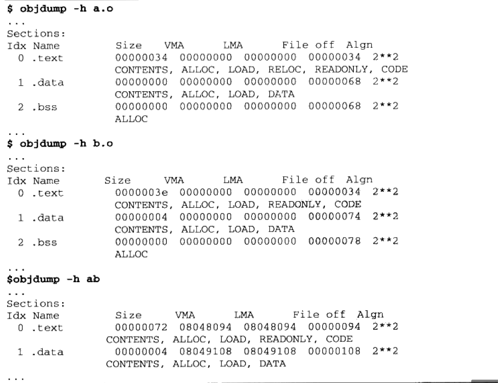
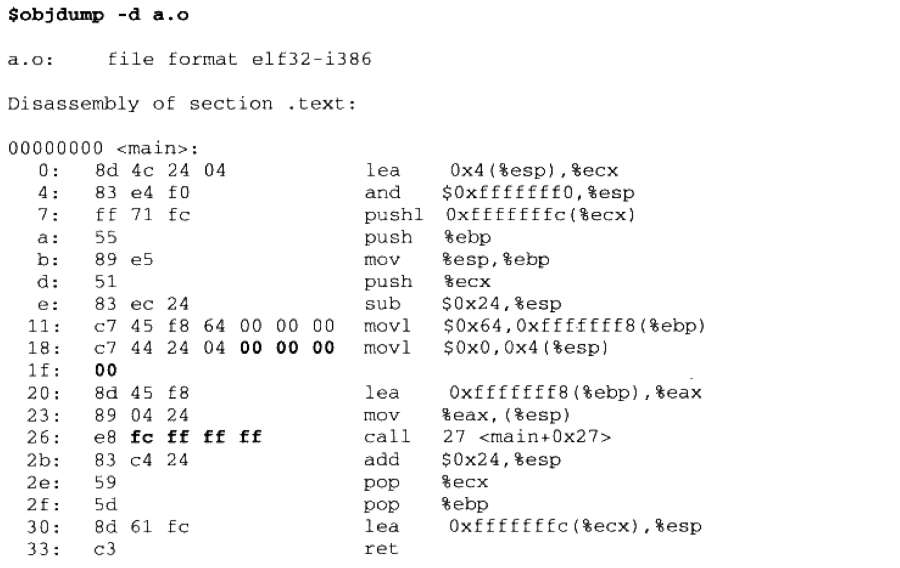
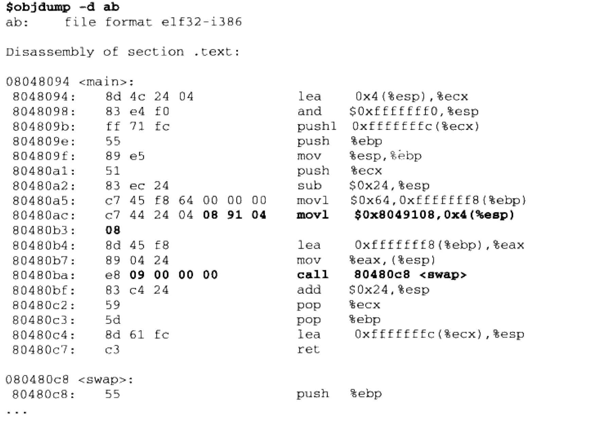
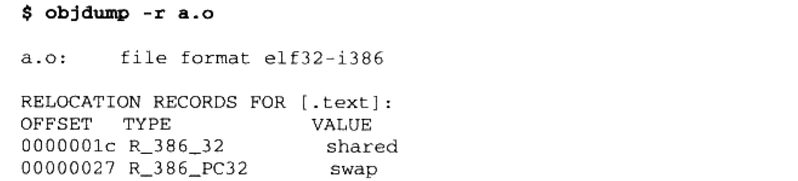

# 静态链接

示例代码：

```c
/* a.c */
extern int shared;

int main() {
    int a = 100;
    swap(&a, &shared);
}

/* b.c */
int shared = 1;

void swap(int *a, int *b) {
   *a ^= *b ^= *a ^= *b;
}
```

>   `gcc -c a.c b.c` ==> 生成`a.o`和`b.o`

## 1. 空间和地址分配

>   `相似段合并`

常用链接器一般都采用**`两步链接`**的方法，即链接过程分为两步：

**`第一步，空间与地址分配`**。扫描所有的输入目标文件，并且获得它们的各个段的长度、属性和位置，并将输入目标文件中的符号表中所有的符号定义和符号引用收集起来，统一将它们放到一个全局符号表。

**`第二步，符号解析和重定义`**。使用上面第一步中收集到的所有信息，读取输入文件中段的数据、重定位信息，并且进行符号解析与重定位、调整代码中的地址等。


使用**`ld a.o b.o -e main -o ab`**链接a.o和b.o

+   `-e main`表示将`main`函数作为程序入口，`ld`链接器默认的程序入口为`_start`
+   `-o ab`表示将链接输出文件名为ab，默认为a.out




### 1.1 符号地址的确定

还是以`a.o`和`b.o`为例，在链接的第一步扫描和空间分配阶段，会按照**`相似段合并`**的方式进行空间分配，这里输入文件中的各个段在链接之后的虚拟地址就已经确定了，如上图所示，`.text`段起始地址为`0x08048094`、`.data`段起始地址为`0x08049018`。

当上一步完成之后，链接器开始计算各个符号的虚拟地址。因为各个符号在段内的相对位置是固定的，所以这时`main`、`shared`、`swap`的地址已经是确定了。


## 2. 符号解析和重定位

### 2.1 重定位

完成空间和地址分配之后，链接器就进入`符号解析和重定位`的步骤，这也是链接器的核心内容。

先来看一下`a.o`是如何使用`shared`和`swap`这两个外部变量/函数的：




可以看到，`a.o`共定义了一个函数`main`。这个函数占用`0x33`个字节，共17条指令。已经用粗体标出了这两个引用`shared`和`swap`的位置。对于`shared`的引用是一条`mov`指令，这条指令共占用8字节，它的作用是**`将"shared"的地址赋值到"esp+4"的偏移地址中去，前4个字节是指令码，后4个字节是"shared"地址`**。这里只关心后面4个字节部分，即

```assembly
C4 44 24 04 00 00 00 00  movl $0x0, 0x4(%esp)
```

中后4个字节**`0x00000000`**。

同样的，对于`swap`函数的调用指令如下

```assembly
E8 FC FF FF FF   call 27 <main+0x27>
```


可以看到，编译器在编译a.c时，由于不知道`shared`和`swap`两个符号地址，选择暂时用`0x00000000`和`0xFCFFFFFF`代替，而真正的地址计算工作则是由**`链接器`**完成。从前面空间和地址分配可以得知，链接器在完成地址和空间分配后就可以确定所有符号的虚拟地址了，那么**`链接器就可以根据符号的地址对每个需要重定位的指令进行修正`**。

如下图所示，链接器确实完成了符号重定位工作：




### 2.2 重定位表

链接器是如何确定哪些指令需要调整或重定位，以及如何进行调整？比如`mov`和`call`指令的调整方式肯定有所不同。

在`ELF`文件中有**`重定位表`**来专门保存这些与重定位相关的信息，它在`ELF`文件中往往是一个或多个段，所以`重定位表`也可以叫做`重定位段`，我们这里统称为`重定位表`。例如`.text`如有要重定位的地方，那么一定会有一个叫`.rel.text`的段，`.data`如有要重定位的地方，也一定会有一个`.rel.data`段。




重定位表其实是**`Elf32_Rel`**结构体数组：

```c
typedef struct
{
    Elf32_Addr    r_offset;               /* Address */
    Elf32_Word    r_info;                 /* Relocation type and symbol index */
} Elf32_Rel;
```

+   **`r_offset`**：重定位入口的偏移
+   **`r_info`**：重定位入口的类型和符号，低8位表示重定位入口的类型，高24位表示重定位入口的符号在符号表中的下标


### 2.3 符号解析

通过前面指令重定位的介绍，可以更加深层次地理解为什么缺少符号的定义会导致链接错误。其实重定位过程也伴随着符号的解析过程，每个目标文件都可能定义一些符号，也可能引用定义在其它目标文件的符号。**`在重定位过程中，每个重定位的入口都是对一个符号的引用，那么当链接器需要对某个符号的引用进行重定位时，它就要确定这个符号的目标地址。这个时候链接器就会去查找由所有输入目标文件的符号表组成的全局符号表，找到相应的符号后进行重定位`**。

例如，`a.o`的符号表中`"GLOBAL"`类型的符号，除了**`main`**函数是定义在代码段，其它两个**`shared`**和**`swap`**都是**`UND`**，这种未定义的符号都是因为该目标文件中有关于它们的重定位项。所以在链接器扫描完所有目标文件后，所有这些未定义的符号都应该能在全局符号表中找到，否则链接器就报符号未定义错误。


### 2.4 指令修正方式

对于32位x86平台下的ELF文件的重定位入口所修正的指令寻址方式只有两种：

+   绝对近址32位寻址
+   相对近址32位寻址

按2.2节所说，重定位入口的`r_info`成员低8位表示重定位入口的类型：

>   +   **`A`**： 保存在被修正位置的值
>   +   **`P`**： 被修正的位置（相对于段开始的偏移量或者虚拟地址），注意，该值可通过`r_offset`计算得到
>   +   **`S`**： 符号的实际地址，即由`r_info`的高24位指定的符号的实际地址

+   **`R_386_32`**：值1，重定位修正方法为`绝对寻址修正 S+A`
+   **`R_386_PC32`**：值2，重定位修正方法为`相对寻址修正 S+A-P`


举例来说，假设在将`a.o`和`b.o`链接成可执行文件后，`main`函数的虚拟地址为`0x1000`，`swap`函数的虚拟地址为`0x2000`，`shared`变量的虚拟地 址为`0x3000`。当对`a.o`进行重定位时：

+   **`"shared"绝对地址修正`**：修正后的结果为S+A，
    +   `S`是`shared`实际地址，即0x3000
    +   `A`是被修正位置的值，即0
    +   所以`shared`这个重入口修正为: 0x3000
+   **`"swap"`相对地址修正**：S+A-P
    +   `S`是`swap`的实际地址，即0x2000
    +   `A`是被修正位置的值，即0xFCFFFFFF(-4)
    +   `P`为被修正的位置，这个值应该是被修正位置的虚拟地址，即0x1000+0x27
    +   所以`swap`这个重定位入口修正为: 0x2000 + (-4) - (0x1000 + 0x27)


**总结：`绝对地址修正和相对地址修正的区别就是绝对地址修正后的地址为该符号的实际地址；相对地址修正后的地址为符号距离被修正位置的地址差`**。


## 3. COMMON块

>   `COMMON`块主要用来解决弱符号可能导致的同一个符号定义在多个文件中，并且类型不同的问题。

实际操作过程中没的遇到，略过...


## 4. C++相关问题

略...


## 5. 静态库链接

一个比较初步的问题，*`程序如何使用操作系统提供的API`*。在一般情况下，一种语言的开发环境往往会附带有**`语言库（Language Library）`**，这些库就是对操作系统API的包装。

其实一个`静态库`可以简单看作是**`一组目标文件的集合`**，即很多目标文件经过压缩打包后形成的文件。例如在`Linux`中最常用的C语言静态库libc位于*`/usr/lib/libc.a`*（注，在CentOS 9上是`/usr/lib/libc_nonshared.a`），它属于glibc项目的一部分。

我们知道在一个C语言的运行库中，包含了很多跟系统功能相关的代码，比如输入输出、文件操作、内存管理等。glibc本身就是用C语言开发的，它由成百上千个C语言源文件编译而成的目标文件组成。如果把这些目标文件直接提供给库的使用者，很大程序上会造成文件传输、管理和组织方面的不便，于是通常人们使用"ar"压缩程序将这些目标文件压缩在一起，并对其进行编号和索引，这就形成了`libc.a`这样的静态库文件。


## 6. 链接控制脚本

链接器一般都提供多种控制整个链接过程的方法：

+   使用命令行参数
+   将链接指令存放在目标文件里面
+   使用链接控制脚本
    +   可以使用**`ld -verbose`**来查看`ld`的默认链接脚本

示例源文件`tinyhelloworld.c`

```c
char* str = "Hello World!\n";

void print() {
    asm ("movl $13, %%edx \n\t"
	      "movl %0, %%ecx \n\t"
        "movl $0, %%ebx \n\t"
        "movl $4, %%eax \n\t"
        "int $0x80 \n\t"
        ::"r"(str):"edx","ecx","ebx");	
}

void exit() {
    asm ("movl $42, %ebx \n\t"
       "movl $1, %eax \n\t"
       "int $0x80 \n\t");
}
 
void nomain() {
    print();
    exit();
}
```

+   使用了**`GCC内嵌汇编`**，进行了`int $0x80`系统调用，`eax`为调用号，`ebx`、`ecx`、`edx`等通用寄存器来传递参数

+   **`print`**函数：使用了Linux的`WRITE`系统调用

    >   系统调用号`eax=0`
    >
    >   `ebx`存储写入的文件句柄，这里使用标准输出，ebx=0
    >
    >   源字符串地址，ecx=str
    >
    >   源字符串长度，edx=13

+   **`exit`**函数：使用了`EXIT`系统调用

    >   eax = 1
    >
    >   ebx = 42，为程序返回码

    

### 6.1 普通编译tinyhelloworld.c

```shell
gcc -c -fno-builtin -m32 tinyhelloworld.c

ld -m elf_i386 -static -e nomain -o tinyhelloworld tinyhelloworld.o
```

+   **`-fno-builtin`**：GCC编译器提供了很多内置函数，它会把一些常用的C库函数替换成编译器的内置函数，以达到优化的目的，这里关闭GCC的这个功能
+   **`-static`**：ld使用静态链接的方式来链接程序
+   **`-e nomain`**：程序入口函数为`nomain`
+   **`-o tinyhelloworld`**：指定输出可执行文件名


### 6.2 使用ld链接脚本tinyhelloworld.lds

```
ENTRY(nomain)

SECTIONS
{
    . = 0x08048000 + SIZEOF_HEADERS;
    tinytext : { *(.text) *(.data) *(.rodata) }
    /DISCARD/ : { *(.comment) }
}
```

+   **`ENTRY`**指定程序入口
+   **`SECTIONS`**为链接控制脚本的主体
    +   **`. = 0x08048000 + SIZEOF_HEADERS`**：设置虚拟地址
    +   **`tinytext : { *(.text) *(.data) *(.rodata) }`**：所有输入文件中的名字为".text"、".data"、".rodata"段依次合并到输出文件的"tinytext"段
    +   **`/DISCARD/ : { *(.comment) }`**：丢弃所有输入文件中的名字为".comment"的段

```shell
gcc -c -fno-builtin -m32 tinyhelloworld.c

ld -m elf_i386 -T tinyhelloworld.lds  -static -e nomain -o tinyhelloworld_by_script tinyhelloworld.o
```


### 6.3 ld链接控制脚本语法

略...
