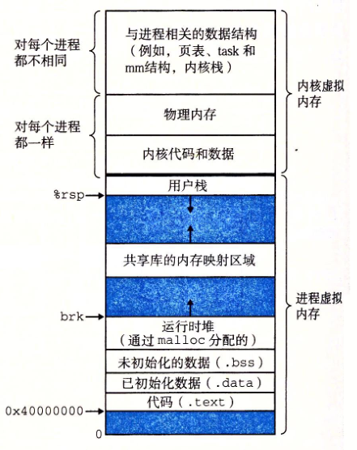
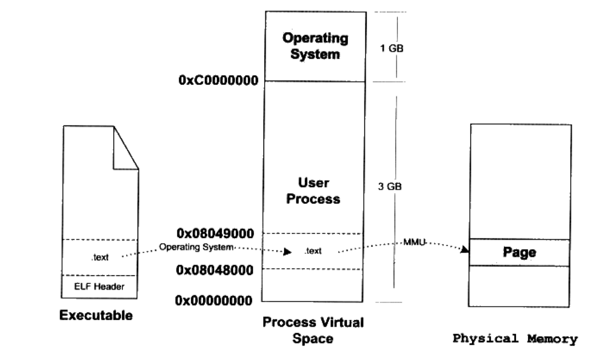
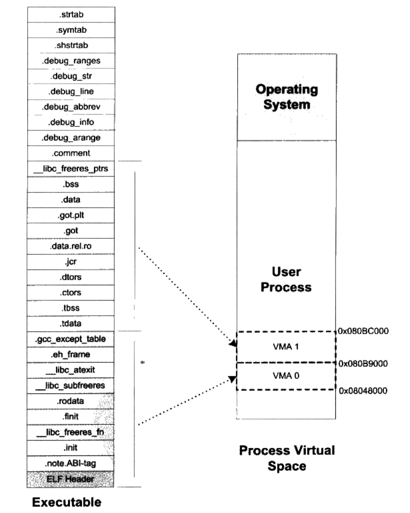
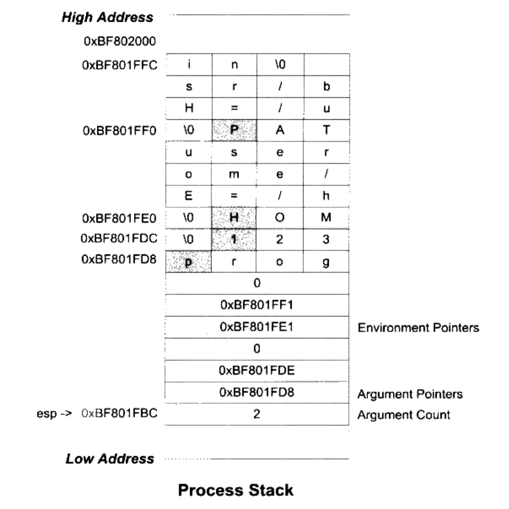

# 可执行文件的装载与进程

>   《程序员的自我修养》第6章 '可执行文件的装载与进程'

## 1. 进程虚拟空间

 

+   Linux下内存分配以页为单位，而页是通过段管理
+   一个Linux进程的虚拟地址空间分布如上图所示，分为用户空间和内核空间。对于一个32位操作系统来说，4GB的空间分为两部分，低地址的0~3G给用户空间，高地址的3G~4G给内核空间


## 2. 装载的方式

程序运行时是有局部性原理的，所以可以将程序最常用的部分驻留在内存中，而将一些不太常用的数据存放在磁盘里，这就是`动态装入`的基本原理。有两种典型的动态装载方法:

+   覆盖装入 - 已被淘汰
+   页映射


## 3. 从操作系统角度看可执行文件的装载

### 3.1 进程的建立

从操作系统的角度来看，一个进程最关键的特征就是它拥有独立的虚拟地址空间，使它有别于其它进程。一个进程的执行同时都伴随着一个新的进程的创建，来看看这种最通常的情形：创建一个进程，装载相应的可执行文件并且执行。在有虚拟存储的情况下，上述过程最开始只需要做三件事:

+   创建一个独立的虚拟地址空间

    >   建立虚拟空间到物理内存的映射关系，初始时只是分配一个页目录（Page Directory）而已

+   读取可执行文件头，并且建立虚拟空间与可执行文件的映射关系

    >   建立虚拟空间到可执行文件的映射关系。因为当程序执行发生页错误时，操作系统将从物理内存中分配一个物理页，然后将该"缺页"从磁盘读取到内存中，再设置缺页的虚拟页和物理页的映射关系，这样程序才得以正常运行。但是很明显的一点是，当操作系统捕获到缺页错误时，**`它应知道程序当然需要的页在可执行文件中的哪一个位置`**。

+   将CPU的指令寄存器设置成可执行文件的入口地址，启动运行


### 3.2 页错误

上述过程之后中，可执行文件的真正指令和数据都没有被装入内存中。操作系统只是通过可执行文件头部的信息建立起可执行文件和进程虚拟空间之间的映射关系而已。

假设程序入口地址为0x08048000，则好是.text段的起始地址，并且空间不够4K，当CPU打算执行这个地址的指令时，发现页面0x08048000~0x08049000是个空页面，于是它认为这是一个`页错误(Page Fault)`。CPU将控制权交给操作系统，操作系统有专门的页错误处理例程来处理这种情况。这时候装载过程的第二步建立的数据结构起到了很关键的作用。**`操作系统将查询这个数据结构，然后找到空页面所在的VMA，计算出相应的页面在可执行文件中的偏移，然后在物理内存中分配一个物理页面，将进程中该虚拟页与分配的物理页之间建立映射关系，然后把控制权再还回给进程，进程从刚才页错误的位置重新开始执行`**。




## 4. 进程虚拟空间分布

### 4.1 EFL文件链接视图和执行视图

在一个正常的进程中，可执行文件包含的往往不止代码段，还有数据段、BSS段等，所以映射到进程虚拟空间的往往不止一个段。当段的数量增多时，就会产生空间浪费的问题。因为EFL文件在映射时，是以系统的页长度为单位的，那么每个段在映射时的长度应该都是系统页长度的整数倍；如果不是，那么多余部分也将占用一个页。

当我们站在操作系统装载可执行文件的角度看问题时，可以发现它**`并不关心可执行文件各个段所包含的实际内容，而只关心一些跟装载相关的问题，最主要是段的权限（可读、可写、可执行）`**。EFL文件中，段的权限往往只有为数不多的几种组合，基本是三种:

+   以代码段为代表的权限为可读可执行的段
+   以数据段和BSS段为代表的权限为可读可写的段
+   以只读数据段为代表的权限为只读的段

那么可以找到一种简单的方案就是：**`对于相同权限的段，把它们合并到一起当作一个段进行映射`**。


ELF引入了一个概念叫**`"Segment"`**，`一个"Segment"包含一个或多个属性类似的"Section"`。**`"Segment"的概念实际上是从装载的角度重新划分了ELF的各个段`**，而系统正是按照"Segment"而不是"Section"来映射可执行文件的。

例如如下代码:

```c
#include <stdlib.h>

int main() {
    while(1) {
        sleep(1000);
    }
    return 0;
}
```

**`gcc -static -m32 SectionMapping.c -o SectionMapping.elf`**命令静态链接后生成可执行文件，是一个Linux下很典型的可执行文件。

+   通过`readelf`查看Section，截图未截完，大概理解意思就行:

    >   

+   同时`readelf`还可以查看ELF的"Segment"。正如描述"section"属性的结构叫做`段表`，描述"Segment"的结构叫做**`程序头（Program Header）`**，它描述了ELF文件该如何被操作系统映射到进程的虚拟空间:

    >   

    +   可以看到，可执行文件中共有5个"Segment"。从装载角度看，目前只关心两个**`LOAD`**类型的"Segment"，因为只有它是需要被映射的。可以用下图来表示"SegmentMapping.elf"可执行文件的段与进程虚拟空间的映射关系。

        >   

+   所以总的来说，"Segment"和"Section"是从不同角度来划分同一个可执行文件。这个在EFL中被称为不同的**`视图`**：从"Section"的角度来看ELF文件就是**`链接视图`**，从"Segment"的角度来看ELF文件就是**`执行视图`**。

### 4.2 堆和栈

在操作系统里面，VMA除了被用来映射可执行文件中的各个"Segment"之外，还被用来**`对进程的地址空间进程管理`**，进程的`栈`和`堆`等空间在进程的虚拟空间中的表现也是以VMA的形式存在的，很多情况下，一个进程的栈和堆分别都有一个对应的VMA。


+   第一列：VMA地址范围
+   第二列：VMA权限，r-可读、w-可写、x-可执行、p-表示私有、s-表示共享
+   第三列：偏移，VMA对应的Segment在映像文件中的偏移
+   第四列：映像文件所在设备的主设备号和次设备号
+   第五列：映像文件的节点号
+   第六列：映像文件的路径


通过上面的例子，小结关于进程虚拟地址空间的概念：**`操作系统通过给进程空间划分出一个个VMA来管理进程的虚拟空间；基本原则是将相同权限属性、有相关映像文件的映射成一个VMA`**。

一个进程基本上可以分为如下几种VMA区域：

+   代码VMA，权限只读、可执行，有映像文件
+   数据VMA，权限可读写、可执行，有映像文件
+   堆VMA，权限可读写、可执行，无映像文件，匿名，可向上扩展
+   栈VMA，权限可读写、不可执行，无映像文件，匿名，可向下扩展


### 4.3 段地址对齐

//TODO


### 4.4 进程栈初始化

进程则启动时，需要知道一些进程运行的环境，最基本的就是`系统环境变量`和`进程运行参数`。很常见的一种做法是操作系统在进程启动前将这些信息提前保存到进程的虚拟空间的栈中(也就是Stack VMA)。

假设系统中有两个环境变量:

```shel
HOME=/home/user
PATH=/usr/bin
```

该程序的命令行是*`prog 123`*，并且假设堆栈段底部地址为0xBF802000，那么进程初始化后的堆栈就如下图所示:



+   栈顶寄存器esp指向的位置就是初始化以后堆栈的顶部
    +   最前面4个字节是命令行参数数量，示例中为2
    +   紧接着就是指向两个命令行参数字符串的指针
    +   后面跟着一个0
    +   接着是两个指向环境变量字符串的指针
    +   后面跟着一个0表示结束
+   进程启动后，程序的库部分会把堆栈里的初始化信息中的参数信息传递给main()函数，即main()函数的两个`argc`和`argv`参数


## 5. Linux内核装载ELF过程简介

在Linux系统的bash下输入一个命令执行某个ELF程序时，Linux是怎样装载这个文件并执行的?

+   在用户层面，bash进程会调用`fork()`系统调用创建一个新的进程，然后新进程调用**`execve()`**系统调用执行指定的ELF文件

    >   // execve()系统调用被定义在unistd.h，原型如下
    >
    >   int execve(const char *filename, char *const argv[], char *const envp[]);
    >
    >   三个参数分别表示初执行的程序文件名、执行参数和环境变量。
    >
    >   
    >
    >   Glibc对execve()系统调用进行了包装，提供了`execl()`、`execlp()`、`execle()`、`execv()`、`execvp()`五个不同形式的exec系列API，它们只是在调用的参数形式上有所区别，但最终都会调用到`execve()`这个系统调用。 

+   在内核中，`execve()`系统调用的相应入口是**`sys_execve()`**，定义在`arch/i386/kernel/Process.c`中。**`sys_execve()`**进行一些参数的检查复制后，调用**`do_execve()`**。

    +   `do_execve()`首先查找被执行的文件，并读取文件的前128字节，并根据前128字节中的信息确定被执行文件的格式，是ELF可执行文件、a.out可执行文件还是其它类型的文件，都需要根据这128字节来判断。
    +   调用*`search_binary_handle()`*去搜索和匹配合适的可执行文件装载处理过程。以ELF可执行文件为例，其对应的装载处理过程叫做**`load_elf_binary()`**，这个函数定义在**`fs/Binfmt_elf.c`**，主要步骤如下：
        +   检查ELF可执行文件的有效性
        +   寻找动态链接的`".interp"`段，设置动态链接器路径
        +   根据ELF可执行文件的程序头表描述，对ELF文件进行映射，比如代码、数据、只读数据
        +   初始化ELF进程环境，比如进程启动时EDX寄存器的地址应该是**`DT_FINI`**的地址（参照动态链接）
        +   将系统调用的返回地址修改成ELF可执行文件的入口点，这个入口点取决于程序的链接方式，对于静态链接的ELF可执行文件，这个入口点就是ELF文件头中`e_entry`所指的地址；对于动态链接的ELF可执行文件，程序入口点是动态链接器。

+   `load_elf_binary()`执行完毕，返回至`do_execve()`再返回至`sys_execve()`，之后从`sys_execve()`系统调用从内核态返回至用户态时，EIP寄存器直接跳转到了ELF程序的入口地址，于是新程序开始执行，ELF文件装载完成。