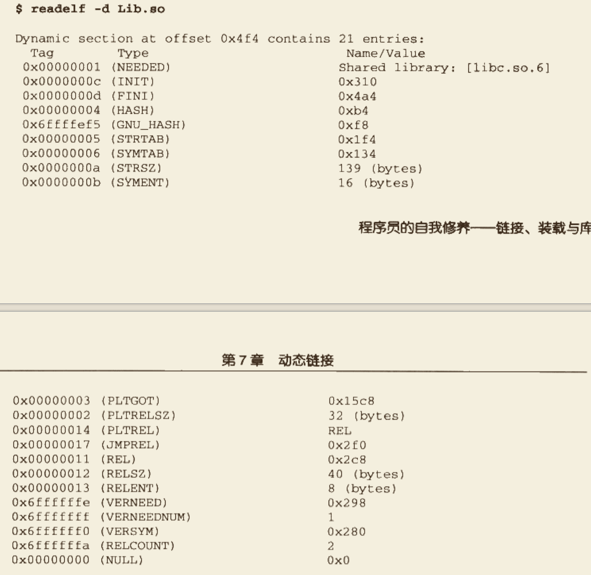

# 动态链接

## 1. 为什么要动态链接

>   静态链接缺点：浪费内存和磁盘空间、模块更新困难等问题。

不对那些组成程序的目标文件进行链接，等到程序运行时才进行链接。也就是说，把链接这个过程推迟到了运行时再进行，这就是**`动态链接`**的基本思想。


 

### 1.1 动态链接的基本实现

`动态链接`的基本思想是把程序按照模块拆分成各个相对独立的部分，在程序运行时才将它们链接在一起形成一个完整的程序，而不是像静态链接一样把所有的程序模块都链接成一个单独的可执行文件。

`动态链接`涉及运行时的链接及多个文件的装载，必需要有操作系统的支持。在Linux系统中，ELF动态链接文件被称为**`动态共享对象(DSO, Dynamic Shared Object)`**，简称`共享对象`，一般都是以`.so`为扩展名的一些文件。

在Linux中，常用的C语言库的运行库glibc，它的动态链接形式的版本保存在**`/lib`**目录下，文件名叫做**`libc.so`**。当程序被装载时，系统的**`动态链接器`**会将程序所需要的所有动态链接库（最基本的就是libc.so）装载到进程的地址空间，并且将程序中所有未决议的符号绑定到相应的动态链接库中，并进行重定位工作。

程序的动态链接工作是程序在装载时由`动态链接器`完成的，必定会带来一些性能损耗，当然可以通过优化方法来提高其效率，例如**`延迟绑定`**等方法。

## 2. 简单的动态链接的例子

```c
/* Program1.c */
#include "Lib.h"
int main() {
    foobar(1);
    return 0;
}

/* Program2.c */
#include "Lib.h"
int main() {
    foobar(2);
    return 0;
}

/* Lib.c */
#include <stdio.h>
void foobar(int i) {
    printf("Printing from Lib.so %d\n", i);
}

/* Lib.h */
#ifndef LIB_H
#define LIB_H
void foobar(int i);
#endif
```

+   将Lib.c编译成一个共享对象文件

    ```shell
    gcc (-m32) -fPIC -shared -o Lib.so Lib.c
    ```

    +   `-shared`表示产生共享对象
    +   `-fPIC`产生地址无关代码，见3.3节

+   分别编译链接Program1.c和Program2.c

    ```shell
    gcc (-m32) -o Program1 Program1.c ./Lib.so
    gcc (-m32) -o Program2 Program2.c ./Lib.so
    ```

    +   从`Program1`的角度看，整个编译和链接过程如下:

        >    

    +   当模块Program1.c被编译成Program1.o时，编译器还不知道`foobar()`函数的地址。当链接器将Program1.o链接成可执行文件时，如果`foobar()`是一个定义在某个动态共享对象中的函数，那么**`链接器就会将这个符号的引用标记为一个动态链接符号，不对它进行地址重定位，把这个过程留到装载时再进行`**。


### 2.1 动态链接程序运行时地址空间分布

为了查看`Program1`程序运行时的进程空间分布，修改`Lib.c`中的`foobar()`函数如下:

```c
#include <stdio.h>
int foobar(int i) {
    printf("Printing from Lib.so %d\n", i);
    sleep(-1);
}
```

编译后可以通过如下命令查看进程的虚拟地址空间分布:


>   可以看到，整个进程虚拟地址空间中，多出了几个文件映射。`Lib.so`与`Program1`一样，它们都是被操作系统用同样的方法映射至进程的虚拟地址空间，只是它们占据的虚拟地址和长度不同。`Program1`除了使用`Lib.so`以外，它还用到了动态链接形式的**`C语言运行库`**libc-2.6.1.so。
>
>   另外还有一个很值得关注的共享对象就是`ld-2.6.1.so`，它实际上是Linux下的**`动态链接器`**。`动态链接器`与普通共享对象一样被映射到了进程的地址空间，在系统开始运行`Program1`之前，首先会把控制权交给动态链接器，由它完成所有的动态链接工作以后再把控制权交给`Program1`，然后开始执行。


### 2.2 查看Lib.so装载属性


>   除了文件类型与普通程序不同之外，其它几乎与普通程序一样。有一点比较不同的是，*`动态链接模块的装载地址是从地址0x00000000开始的`*。从这一点可以推断，**`共享对象的最终装载地址在编译时是不确定的，而是在装载时，装载器根据当前地址空间的空闲情况，动态分配一块足够大小的虚拟地址空间给相应的共享对象`**。

## 3. 地址无关代码

### 3.1 固定装载地址的困扰

上面介绍动态链接遇到的一个问题：**`共享对象在被装载时，如何确定它在进程虚拟地址空间中的位置`**？

为了实现动态链接，我们首先遇到的问题就是*`共享对象地址的冲突问题`*。回顾静态链接的实现，程序模块的指令和数据中可能会包含一些绝对地址的引用，我们在链接产生输出文件时，就要假设模块被装载的目标地址。但是很明显，`在动态链接的情况下，如果不同的模块目标装载地址都一样是不行的`。

以前有一个解决方案，叫做*`静态共享库`*，需要手工分配调整各个模块的加载地址，这种方式太过繁琐，并且有很多其它弊端，所以这种方式已经被`动态链接`所取代。


### 3.2 装载时重定位

为了解决模块装载地址固定的问题，可以设想是否可以让**`共享对象在任意地址加载`**，或者说是**`共享对象在编译时不能假设自己在进程虚拟地址空间中的位置`**。首先想到的办法就是，在链接时，所有绝对地址的引用不做重定位，而把这一步推迟到装载时再完成。*`一旦模块装载地址确定，即目标地址确定，那么系统就对程序中所有的绝对地址引用进行重定位`*。

>   假设函数`foobar`相对于代码段的起始地址是0x100，当模块被装载到0x10000000时，我们假设代码段位于模块的最开始，那么我们就可以确定`foobar`的地址是0x10000100，这时侯，系统遍历模块中的重定位表，把所有对`foobar`的地址引用都重定位至0x10000100

但是，*`装载时重定位`的方法并不适合用来解决共享对象所存在的问题*。可以想象，动态链接模块在被装载映射至虚拟空间后，指令部分是在多个进程间共享的，由于装载时重定位的方法需要修改指令，所以无法做到同一份指令被多个进程共享，*`因为指令被重定位后对于每个进程来讲是不同的`*。然后，动态链接库中的可修改数据部分对于不同的进程来说有多个副本，所以它们可以采用装载时重定位的方法来解决。


### 3.3 地址无关代码

什么是"-fPIC"呢？使用这个参数会有什么效果？

其实目的很简单，希望**`程序模块中共享的指令部分在装载时不需要因为装载地址的改变而改变`**，所以实现的基本想法是**`把指令中那些需要修改的部分分离出来，跟数据部分放在一起，这样指令部分就可以保持不变，而数据部分可以在每个进程中有一个副本`**。这种方案就是目前被称为**`地址无关代码(PIC, Positon-independent Code)`**的技术。

先分析模块中各种类型的地址引用方式，把共享对象模块中的地址引用按照是否为跨模块分为两类：模块内部引用和模块外部引用。按照不同的引用方式又可分为指令引用和数据访问，这样就得到了四种情况:

+   模块内部函数调用、跳转等
+   模块内部数据访问，比如模块中定义的全局变量、静态变量
+   模块外部的函数调用、跳转等
+   模块外部的数据访问


#### 3.3.1 类型一 模块内部函数调用或跳转

模块内部的跳转、函数调用都可以是相对地址调用，或者是基于寄存器的相对调用，所以对于这种指令是不需要重定位的。

>   但是这种方式还存在一个叫做共享对象**`全局符号介入(Global Symbol Interpostion)`**的问题，这个问题在后面关于"动态链接的实现"中会详细介绍。


#### 3.3.2 类型二 模块内部数据访问

显然，指令中不能直接包含数据的绝对地址，唯一的办法就是`相对寻址`。我们知道，一个模块前面一般是若干个页的代码，后面紧跟着若干个页的数据，这些页之间的相对位置是固定的，也就是说，*`任何一条指令与它需要访问的模块内部数据之间的相对位置是固定的`*，那么只需要相对于当前指令加上固定的偏移量就可以访问模块内部数据了。

在现代的体系结构中，*`数据的相对寻址往往没有相对于当前指令地址(PC)的寻址方式`*，所以ELF用了一个很巧妙的办法来得到当前的PC值，然后再加上一个偏移量就可以达到访问相应变量的目的了。


+   用粗体表示的是`bar()`函数中访问模块内部变量a的相应代码。从上面的指令中可以看到，它先调用了一个叫`__i686.get_pc_thunk.cx`的函数，这个函数的作用就是把返回地址的值放到`ecx`寄存器，即把call的下一条指令的地址放到`ecx`寄存器。

+   接着执行一条add指令和一条mov指令，可以看到变量a的地址是add指令地址(保存在ecx寄存器)加上两个偏移量0x118c和0x28，即如果模块被装载到0x10000000这个地址的话，那么变量a的实际地址是将是`0x10000000+0x454+0x118c+0x28`，如下图所示:

    >    


#### 3.3.3 类型三 模块间数据访问

模块间的数据访问目标地址要等到装载时才决定。要使得代码地址无关，基本思想就是把跟地址相关的部分放到数据段里面，很明显，`这些其它模块的全局变量的地址是跟模块装载地址有关的`。

ELF的做法是在**`数据段`**里面建立一个**`指向这些变量的指针数组`**，也称为**`全局偏移表(Global Offset Table, GOT)`**。当代码需要引用该变量时，可以通过GOT中相对应的项间接引用，基本机制如下:


+   当指令中需要访问变量`b`时，程序会先找到`GOT`，然后根据`GOT`中变量所对应的项找到变量的目标地址。每个变量都对应一个4字节的地址，链接器在装载模块的时候会查找每个变量所在的地址，然后填充`GOT`中的各个项，以确保每个指针所指向的地址正确。由于`GOT本身是在数据段`的，所以它`可以在模块装载时被修改`，并且每个进程都可以有独立的副本，相互不受影响。

+   `GOT`如何做到指令的地址无关性？从第二种类型的数据访问我们了解到，`模块在编译时可以确定模块内部变量相对于当前指令的偏移`，那么我们也可以在编译时确定`GOT相对于当前指令的偏移`。确定`GOT`的位置与上面的访问变量`a`的方法基本一样，通过得到PC值然后加上一个偏移量，就可以得到GOT的位置。然后我们根据变量地址在GOT中的偏移量就可以得到变量的地址，当然GOT中每个地址对应于哪个变量是由编译器决定的，比如第一个地址对应变量b，第二个对应变量c等。

    +   再回顾刚才函数`bar()`的反汇编代码。为访问变量b，程序首先计算出变量b的地址在GOT中的位置，即`0x10000000 + 0x454 + 0x118 + (-8) = 0x100015d8`，然后使用寄存器间接寻址方式给变量b赋值2 。

    +   可以使用objdump来查看GOT的位置

        >    

    +   再来看看`pic.so`的需要在动态链接时重定位项:

        >    

    +   可以看到变量b的地址需要重定位，它位于0x15d8，也就是GOT中偏移8，相当于GOT中的第三项（每四个字节一项），正好对应了前面通过指令计算出来的偏移值，即`0x100015d8 - 0x10000000 = 0x15d8`


#### 3.3.4 类型四 模块间调用、跳转

也可以采用`类型三 模块间数据访问`的方法来解决，只是与上面不同的是，此时GOT中相应的项保存的是`目标函数的地址`，当模块需要调用目标函数时，可能通过`GOT`中的项进行间接跳转，基本原理如下图:


+   调用`ext()`函数的方法与上面访问变量b的方式基本类似，先得到当前指令地址PC，然后加上一个偏移得到函数地址在GOT中的偏移，然后一个间接调用:

    >    


#### 3.3.5 地址无关代码小结

>   


### 3.4 共享模块的全局变量问题

3.3节介绍的4种类型还有一个小问题，**`没有包含定义在模块内部的全局变量的情况`**。粗略来看，这种情况的处理方式可以用`类型二`，但是有一种情况很特殊，即*`当一个模块引用了一个定义在共享对象的全局变量的时侯`*。

例如，有一个共享对象定义了一个全局变量`global`，而模块`module.c`中是这么引用的:

```c
extern int global;
int foo() {
    global = 1;
}
```

+   当编译器编译`module.c`时，它无法根据上下文判断`global`是定义在同一模块的其它目标文件，还是定义在另一个共享对象中，即`无法判断是否为跨模块间的调用`。

    +   **`引起问题的原因`**: 假设`module.c`是程序可执行文件的一部分，在这种情况下，由于程序主模块的代码并不是地址无关代码，也就是说代码并不会使用类似于`PIC`的机制，它引用这个全局变量的方式跟普通数据访问方式一样，编译器会产生这样的代码:

        ```assembly
        movl $0x1, XXXXXXXX
        ```

        ，并且链接器会在创建可执行文件时，在它的`.bss`段创建一个global变量的副本。那么问题很明显了，`现在global变量定义在原先的共享对象中，而在可执行文件.bss段还有一个副本`。如果同一变量同时存在于多个位置中，那程序肯定会出问题。
        
    +   **`解决方法`**：**`所有使用这个变量的指令部分都指向位于可执行文件中的那个副本`**。ELF共享库在编译时，默认都把定义在模块内部的全局变量当作定义在其它模块的全局变量，也就是说当作前面的类型四，通过GOT来实现变量的访问。此时就分为了三种情况:
    
        +   共享模块被装载时，某个全局变量在可执行文件中有副本，那么动态链接器就会把GOT中的相应地址指向该副本，这样该变量在运行时就只有一个实例。
        +   如果全局变量在可执行文件中定义，但是在共享模块中初始化，那么动态链接器还需要将该初始化值复制到程序主模块的变量副本中
        +   如果该全局变量在可执行文件中没有副本，那么GOT中的相应地址就指向模块内部的该变量副本。
    
    +   **`假设"module.c"是一个共享对象的一部分`**，那么GCC编译器在`-fPIC`的情况下，就会把对`global`的调用按照跨模块模块产生代码。原因很简单: 编译器无法确定对`global`的引用是跨模块还是模块内部的。即使是模块内部的，按照上面的结论，还是会产生跨模块代码，因为`global`可能被可执行文件使用，从而使得共享模块中对`global`的引用要执行可执行文件中的副本。


### 3.5 数据段地址无关性

通过3.3以及3.4节的方法，能够保证共享对象的代码部分地址无关，但`数据部分是不是也有绝对地址引用的问题呢`？

```c
static int a;
static int* p = &a;
```

+   如果共享对象里面有这样一段代码的话，那么指针`p`的地址就是一个绝对地址，它指向变量`a`，而`a`的地址会随着共享对象的装载地址改变面改变，此时有什么办法解决这个问题？


对于数据段来说，它在每个进程都有一份独立的副本，所以并不担心被进程改变。从这点来看，我们可以选择**`装载时重定位`**的方法来解决数据段中绝对地址引用问题。**`对于共享对象来说，如果数据段中有绝对地址引用，那么编译器和链接器就会产生一个重定位表，这个重定位表里面包含了`R_386_RELATIVE`类型的重定位入口，用于解决上述问题。当动态链接器装载共享对象时，如果发现该共享对象有这样的重定位入口，那么动态链接器就会对该共享对象进行重定位**。


## 4. 延迟绑定（PLT）

动态链接比静态链接灵活，但却是以牺牲一部分性能为代价的。动态链接性能慢的原因有两点: 一是动态链接下对于全局和静态的数据访问都要进行复杂的GOT重定位，然后间接寻址，模块间的调用也要先定位GOT，再间接跳转；二是动态链接的链接工作在运行时完成，这些工作势必减慢程序的启动速度。

ELF采用了一种**`延迟绑定(Lazy Binding)`**的做法，基本思想就是**`当函数第一次被用到时才进行绑定（符号查找、重定位等）`**，如果没有用到则不进行绑定，这种做法可以大大加快程序的启动速度，特别有得于一些有大量函数引用和大量模块的程序。

ELF使用**`PLT(Procedure Linkage Table)`**的方法来实现，这种方法使用了一些很精巧的指令序列来完成。

+   先从动态链接器的角度设想一下：假设liba.so需要调用libc.so中的`bar()`函数，那么当liba.so中第一次调用`bar()`时，这时就需要动态链接器中的某个函数来完成地址绑定工作，假设这个函数叫做`lookup()`，那么它至少需要知道这个地址绑定发生在哪个模块、哪个函数。在这个例子中这两个参数的值分别是liba.so和bar()。在Glibc中，lookup()函数真正的名字叫作**`_dl_runtime_resolve()`**。

+   当调用某个外部模块的函数时，通常做法应该是通过GOT中相应的项进行间接跳转。`PLT`为了实现`延迟绑定`，在这个过程中又增加一层间接跳转。**`调用函数并不直接通过GOT跳转，而是通过一个叫做PLT项的结构进行跳转`**。每个外部函数在`PLT`中都有一个相应的项，比如`bar()`函数在`PLT`中的项的地址称为**`bar@plt`**。下面是`bar@plt`的实现：

    >   ```assembly
    >   bar@plt:
    >   jmp *(bar@GOT)
    >   push n
    >   push moduleID
    >   jump _dl_runtime_resolve
    >   ```
    >
    >   +   第一条指令通过GOT进行间接跳转，`bar@GOT`表示GOT中保存`bar()`这个函数相应的项。如果动态链接器在初始化阶段已经初始化该项，并且将`bar()`的地址填入该项，那个这个跳转指令就可以正常工作，实际函数调用。
    >   +   但为实现延迟绑定，链接器在初始化阶段并没有将`bar()`地址填入该项。**`而是将上面代码的第二条指令"push n"的地址填入"bar@GOT"项中`**，这样在执行第一条语句时就直接跳转到`"push n"`，这个参数`"n"`是`bar`这个符号引用在重定位表**`".rel.plt"`**中的下标。紧接着又是一条"push"指令将模块的ID压栈，然后跳转到**`_dl_runtime_resolve`**。**`_dl_runtime_resolve()`**在进行一系列工作后将`bar()`的真正地址填入`bar@GOT`中。
    >   +   当再次调用`bar@plt`时，直接就可以跳转到对应的函数执行。


### 4.1 PLT真正实现

上面描述的是PLT的基本原理，`PLT`真正的实现要比它的结构稍微复杂一些。ELF将`GOT`拆分成了两个表叫做**`.got`**和**`.got.plt`**。其中**`.got`**保存全局变量引用的地址，**`.got.plt`**保存函数引用的地址。

+   **`.got.plt`**还有一个特殊的地方就是它的前三项是有特殊意义的:

    +   第一项保存**`".dynamic"`**段的地址，这个段描述了本模块动态链接相关的信息

    +   第二项保存的是本模块的ID

    +   第三项保存的是**`_dl_runtime_resolve()`**的地址

        >   其中第二项和第三项由动态链接器在装载共享模块时负责将它们初始化。

    +   其余项分别对应每个外部函数的引用

+   PLT的结构也与示例中的PLT稍有不同，为了减少代码重复，ELF把上面例子中的最后两条指令放到PLT中的第一项，并且规定每一项的长度是16个字节，则好用来存放三条指令。实际的PLT基本结构如下:

    >    

    实际的PLT基本结构代码如下:

    ```assembly
    PLT0:
    push *(GOT+ 4)
    jmp *(GOT+8)
    ...
    bar@plt:
    jmp *(bar@GOT)
    push n
    jmp PLT0
    ```

+   **PLT**在ELF文件中以独立的段存放，段名通常叫做**".plt"**，因为它本身是一些地址无关代码，所以可以跟代码段等一起合并成同一个可读可执行的"Segment"段被装载入内存。


## 5. 动态链接相关数据结构

### 5.1 ".interp"段

动态链接器的位置既不是由系统配置指定，也不由环境参数决定，而是**`由ELF可执行文件决定`**。在动态链接在ELF可执行文件中，有一个专门的段叫**`".interp"`**段，它的内容很简单，里面存放的就是一个字符串，这个字符串就是可执行文件所需要的动态链接器的路径。


### 5.2 ".dynamic"段

`".dynamic"`段保存了动态链接器所需要的基本信息，比如依赖于哪些共享对象、动态链接符号表的位置、动态链接重定位表的位置、共享对象初始化代码地址等。其结构定义在**`"elf.h"`**中:

```c
typedef struct {
    Elf32_Sword d_tag;			//类型值
    union {                 //附加的数值或指针
        Elf32_Word d_val;
        Elf32_Addr d_ptr;
    } d_un;
} Elf32_Dyn;
```

+   几种常见的类型值（定义在"elf.h"里面的宏），下表只列出了一部分定义，还有一些不太常用的暂且忽略，具体可参考LSB手册和elf.h的定义

    >    

+   从上面的这些定义来看，**`".dynamic"`段里面保存的的信息有点像ELF文件头**，只是ELF文件头中保存的是静态链接时相关的内容，比如静态链接时的符号表、重定位表等；".dynamic"这里换成了动态链接所使用的相关信息了。

    >    

+   另外，Linux还提供了一个命令来查看一个程序主模块或一个共享库依赖于哪些共享库，就是`"ldd"`命令

    ```shell
    $ ldd Program1
    				linux-gate.so.1 => (0xffffe000)
            ./Lib.so (0xb7f62000)
            libc.so.6 => /lib/tls/i686/cmov/libc.so.6 (0xb7e0d000)
            /lib/ld-linux.so.2 (0xb7f66000)
    ```

    


### 5.3 动态符号表

在静态链接过程中，`符号表(.symtab)`里面保存了所有关于该目标文件的符号的定义和引用。动态链接的符号与静态链接十分相似，ELF中有一个专门的`动态符号表(.dynsym) (Dynamic Symbol Table)`来保存这些符号。与`.symtab`不同的是，`.dynsym`只保存了与动态链接相关的符号，对于那些模块内部的符号，比如模块私有变量则不保存。很多时候动态链接模块同时拥有`.dynsym`和`.symtab`两个表，`.symtab`中往往保存了所有符号，包括`.dynsym`中的符号。

动态符号表也需要一些辅助表，比如用于保存符号名的字符串表，叫做`动态符号字符串表 (.dynstr) (Dynamic String Table)`；另外动态链接下，需要在程序运行时查找符号，为加快这一过程，往往还需要辅助的`符号哈希表(.hash)`。


### 5.4 动态链接重定位表

在动态链接下，一个共享模块中一旦依赖于其它共享对象，即模块中有对其它模块的符号引用时，导入符号的地址在运行时才确定，所有需要在运行时将这些导入符号的引用修正，即需要重定位。

前面说过，动态链接可执行文件使用的是`PIC`方法编译的，它还是需要在装载时重定位。但此时需要重定位的不是代码段，而是数据段。因为数据段中也可能包含对绝对地址的引用，代码段中绝对地址相关的部分被分离出来，变成了`GOT`，而`GOT`也是数据段的一部分。


#### 5.4.1 动态链接重定位相关结构

在动态链接的文件中，有两个重定位表*`.rel.dyn`*和*`.rel.plt`*，它们分别相当于静态链接时的`.rel.data`和`.rel.text`。`.rel.dyn`实际上是对数据引用的修正，修正的位置位于`.got`和数据段；`.rel.plt`是对函数的修正，修正的位置位于`.gol.plt`。


这里可以看到几种新的重定位入口类型：`R_386_RELATIVE`、`R_386_GLOB_DAT`、`R_386_JUMP_SLOT`，它们都是比较简单的重定位类型。

+   `R_386_GLOB_DAT`和`R_386_JUMP_SLOT`这两种重定位入口表示，被修正位置只需要直接填入符号的地址即可。比如`printf`这个重定位入口，它的类型为`R_386_JUMP_SLOT`，偏移地址为0x000015d8，它实际上位于`.got.plt`中。我们知道，`.got.plt`的前三项是被系统占据的，从第四项开始都是真正存放导入函数地址的地方。而第四项刚好是 `0x000015c8 + 4*3 = 0x000015d4`，即`__gmon_start__`，第五项是`printf`，第六项...，所以Lib.so的`.got.plt`的结构如下图所示: 

    >    

+   `R_386_RELATIVE`类型的重定位入口，实际上就是**`基址重置`**。


### 5.5 动态链接时进程堆栈初始化信息

站在动态链接器的角度看，当操作系统把控制权交给它时，它将开始做链接工作，那么它至少需要知道关于可执行文件和本进程的一些信息，比如可执行文件有几个段、每个段的属性、程序的入口地址等。这些信息往往由操作系统传递给动态链接器，保存在进程的堆栈里面。

前面还提到过，进程初始化时，堆栈里面保存了关于进程执行环境和命令行参数等信息。事实上，堆栈里面还保存了动态链接器所需要的一些`辅助信息`。`辅助信息`的格式也是一个结构数组，定义在`elf.h`中

```c
typedef struct {
 	uint32_t a_type;
  union {
    uint32_t a_val;
  } a_un;
} Elf32_auxv_t;
```


摘录几个比较重要的值:

| a_type   | a_type值 | a_val含义                            |
| -------- | -------- | ------------------------------------ |
| AT_NULL  | 0        | 辅助信息数组结束                     |
| AT_EXEFD | 2        | 可执行文件名柄                       |
| AT_PHDR  | 3        | 可执行文件中`程序头表`在进程中的地址 |
| AT_PHENT | 4        | `程序头表`中每个入口Entry的大小      |
| AT_PHNUM | 5        | `程序头表`中入口Entry数量            |
| AT_BASE  | 7        | 动态链接器本身的装载地址             |
| AT_ENTRY | 9        | 可执行文件入口地址，即启动地址       |


`辅助信息`位于进程堆栈的哪个位置? **`它位于环境变量指针的后面`**。


## 6. 动态链接的步骤与实现

### 6.1 动态链接器自举

`动态链接器`本身也是一个共享对象，但却有它的特殊性。因为没有其它共享对象可以为它进行重定位，为解决这个问题，

+   动态链接器不可以依赖任何其它共享对象，这个可以人为控制保证不使用任何系统库、运行库

+   动态链接器本身所需要的全局和静态变量的重定位工作由它本身完成，这个工作由启动时的一段精巧代码完成，这段启动代码被称为**`自举(Bootstrap)`**。

    >   动态链接器入口就是自举代码入口，自举代码首先找到它自己的`GOT`。而`GOT`第一个入口保存的是`.dynamic`中的信息，自举代码就可以获得动态链接器本身的重定位表和符号表等，从而得到动态链接器本身的重定位入口，先将它们全部重定位，之后动态链接器代码代码中才可以开始使用自己的全局变量和静态变量。


### 6.2 装载共享对象

完成`自举`后，动态链接器将可执行文件和链接器本身的符号表都合并到一个符号表中，称为`全局符号表`。然后动态链接器开始寻找可执行文件依赖的共享对象，前面提到过`.dynamic`段中，有一种类型的入口是`DT_NEEDED`，它指出的是该可执行文件所依赖的共享对象。由此链接器可以列出可执行文件所有需要的共享对象，将它们的名字放到一个装载集合中。之后链接器遍历共享对象名字，找到相应文件，读取其ELF文件头和`.dynamic`段，然后将它相应的代码段和数据段映射到进程空间中。如果这个共享对象还依赖于其它共享对象，则循环处理。

当一个新的共享对象被装载进来的时候，它的符号表会被合并到全局符号表中，所以当所有共享对象都被装载进来后，全局符号表中将包含进程中的所有动态链接所需要的符号。


还涉及到`多个共享对象符号优先组`和`全局符号介入`等问题，这里略过了。

### 6.3 重定位和初始化

上面的步骤完成后，链接器重新遍历可执行文件和每个共享对象的重定位表，将它们的GOT/PLT中每个需要重定位的位置进行修正。因为此时动态链接器已经拥有了进程的全局符号表，所以这个修正过程也比较容易。

重定位完成后，如果某个共享对象有`.init`段，那么动态链接器会执行.`init`段中的代码，用以实现共享对象特有的初始化过程，比如最常见的，共享对象中的C++的全局/静态对象的构造就需要通过*`.init`*来初始化。相应的，共享对象还可能有`.finit`段，当进程退出时会执行其中的代码，可以用来实现C++全局对象析构之类的操作。


### 6.4 Linux动态链接器实现

Linux动态链接器本身是一个共享对象，路径是`/lib/ld-linux.so.2`，是一个符号链接，指向`/lib/ld-x.y.z.so`，这才是真正的链接器文件。

Linux动态链接器是Glibc的一部分，源码位于Glibc的源代码的`elf`目录下，它的实际入口位于`sysdeps/i386/dl-machine.h`中的`_start`(普通程序的入口地址是`_start()`，位于`sysdeps/i386/elf/start.S`)。

`_start`调用位于`elf/rtld.c`的`_dl_start()`函数。`_dl_start()`首先对`ld.so`进行重定位，因为`ld.so`自己就是动态链接器，没有人帮它做重定位工作，所以它只好自己来，叫做`自举`。完成`自举`之后就可以调用其它函数并访问全局变量了。调用`_dl_start_final`，收集一些基本的运行数值，进入`_dl_sysdep_start`，这个函数进行一些平台相关的处理之后就进入了`_dl_main`，这就是真正意义上的动态链接器的主函数了。

`_dl_main`本身非常长，主要的工作就是前面提到的对程序所依赖的共享对象进行装载、符号解析和重定位，这里不详细展开。


关于动态链接器的几个问题:

+   `动态链接器本身应该是静态链接的`
+   `动态链接器本身可以是PIC的，也可以不是PIC的。Linux下的ld-linux.so.2是PIC的`
+   `动态链接器可以被当作可执行文件运行，那么装载地址是多少，跟其它共享库没区别`


## 7. 显式运行时加载

`显式运行时加载`就是让程序自己在运行时控制加载指定的模块，并且可以在不需要该模块时将其卸载。从前面了解的来看，如果动态链接器可以在运行时将共享模块装载进内存并且可以进行重定位等操作，那么这种运行时加载在理论上也是很容易实现的。而且一般的共享对象不需要进行任何修改就可以进行时装载，这种共享对象被叫做*`动态装载库`*。


### 7.1 dlopen()

`dlopen()`用来打开一个库，并将其加载到进程的地址空间，完成初始化过程，它的C原型定义为:

```c
void *dlopen(const char *filename, int flag);
```

+   第一个参数可以是文件绝对路径，也可以是相对路径。如果是相对路径，`dlopen()`会尝试以一定的顺序去查找该动态库文件:
    +   查找环境变量`LD_LIBRARY_PATH`指定的一系列目录
    +   查找由`/etc/ld.so.cache`里面所指定的共享库路径
    +   依次查找`/lib`、`/usr/lib`这两个目录 
+   第二个参数`flag`表示函数符号的解析方式，
    +   `RTLD_LAZY`表示使用延迟绑定，当函数第一次被用到时才进行绑定，即PLT机制
    +   `RTLD_NOW`表示当模块加载时即完成所有函数绑定工作，如果有函数绑定时出现问题，`dlopen()`返回错误
    +   `RTLD_GLOBAL`可以跟上面两者任意一个一起使用，它表示将被加载模块的全局符号合并到进程的全局符号表中，使得以后加载的模块可以使用这些符号
+   `dlopen()`返回值是被加载模块的句柄，这个句柄在后面使用`dlsym`或者`dlclose`时需要用到。另外`dlopen()`还会在加载模块时执行模块中初始化部分的代码，在完成装载、映射和重定位后，会执行`.init`段的代码后返回


### 7.2 dlsym()

`dlsym()`是运行时装载的核心部分，可以通过这个函数找到所需要的符号。

```c
void *dlsym(void *handle, const char *symbol);
```

+   第一个参数是`dlopen()`返回的动态库句柄
+   第二个参数是所要查找的符号的名字，一个以`\0`结尾的C字符串。如果`dlsym()`找到相应的符号，则返回该符号的值；没找到则返回NULL。返回值对于不同类型的符号，意义是不同的:
    +   对于函数符号，返回函数的地址
    +   变量符号，返回变量地址
    +   常量符号，返回常量的值


### 7.3 dlerror()

用来判断上一次函数调用是否成功

```c
char *dlerror(void);
```


### 7.4 dlclose()

卸载一个已经加载的模块。卸载过程正好和加载相反，先执行`.finit`段的代码，然后将符号从符号表中去除，取消进程空间和模块的映射关系，然后关闭模块文件。

```c
int dlclose(void *handle);
```


### 7.5 示例

...
