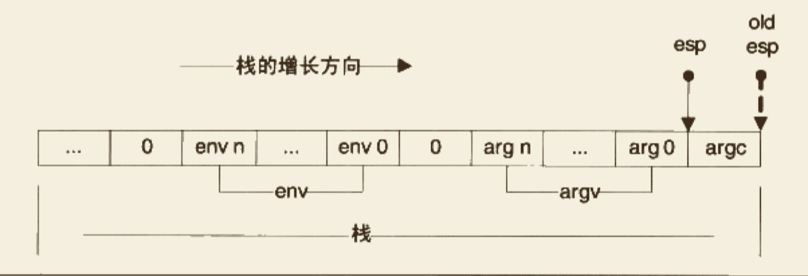

# 运行库

>   参考《程序员的自我修养》第11章


## 1. 入口函数和程序初始化


### 1.1 程序是从main开始吗

各种事实都可以证明，`程序并不是从main函数开始`。操作系统装载程序之后，首先运行的代码并不是main，而是某些别的代码，这些代码负责准备好main函数执行所需要的环境，并且负责调用main函数，这样才可以在main函数里放心地写各种代码。在main返回之后，它会记录main函数的返回值，调用atexit注册的函数，然后结束进程。

运行这些代码的函数称为`入口函数`或`入口点`，视平台的不同而有不同的名字。程序的入口点实际上是一个程序的初始化和结束部分，它往往是运行库的一部分。一个典型的程序运行步骤大概如下：

+   操作系统在创建进程后，把控制权交到了程序的入口，这个入口往往是运行库中的某个入口函数
+   入口函数对运行库和程序运行环境进行初始化，包括堆、I/O、线程、全局变量构造等
+   入口函数在完成初始化后，调用main函数，正式开始执行程序主体部分
+   main函数执行完毕之后，返回到入口函数，入口函数进行清理工作，包括全局变量析构、堆销毁、关闭I/O等，然后进行系统调用结束进程


### 1.2 入口函数如何实现

>   主要介绍glibc的入口函数实现。glibc的启动过程在不同情况下差别很大，比如静态glibc和动态glibc的差别，glibc用于可执行文件和用于共享库的差别，这样的差别可以组合出4种情况。
>
>   下面只选取最简单的静态glibc用于可执行文件的时候作为例子，其它不作详述。

glibc的程序入口为`_start`（这个入口是由ld链接器默认的链接脚本所指定的，可以通过相关参数设定入口），`_start`由汇编实现，并且和平台相关，下面单独看i386的`_start`实现:

```assembly
_start:
	xorl %ebp, %ebp
	popl %esi
	movl %esp, %ecx
	
	pushl %esp
	pushl %edx
	pushl $__libc_csu_fini
	pushl $__libc_csu_init
	pushl %ecx
	pushl %edi
	pushl main
	call __libc_start_main
	
	hlt
```


这里省略了一部分代码，可以看到`_start`函数最终调用了名为`__lib_start_main`的函数。从`pushl %esp`~`pushl main`的代码是对该函数的完整调用过程，这几个pushl压栈指令用于给函数传递参数。

最开始的三条指令的作用分别为: 

+   `xorl %ebp, %ebp`就是让ebp寄存器清零，这样做的目的是表明当前是程序的最外层函数

+   `popl %esi; movl %esp, %ecx`: 在调用`_start`前，装载器会把用户的参数和环境变量压入栈中，按照其压栈的方法，实际上栈顶的元素是`argc`，而接着其下就是`argv`和环境变量的数组。

    >   
    >
    >   +   `popl %esi`将`argc`存入了`esi`
    >   +   `mov %esp, %ecx`将栈顶地址（此时就是argv和环境变量env数组的起始地址）传给`ecx`


综上分析，`_start`逻辑大概相当于如下伪代码:

```c
void _start() {
    %ebp = 0;
    int argc = pop from stack;
    char** argv = top of stack;
    __libc_start_main(main, argc, argv, __libc_csu_init,
                     __libc_csu_fini,
                     edx, top of stack);
}
```

+   其中argv除了指向参数表外，还隐含紧接着环境变量表。这个环境变量表要在`__libc_start_main`里从argv内提取出来


实际执行代码的函数是`__libc_start_main`，由于代码很长，下面一段一段的看:

**`_start -> __libc_start_main :`**

```c
int __libc_start_main (
					int (*main) (int, char **, char **),
					int argc, 
					char** ubp_av,
					__typeof(main) init,
					void (*fini) (void),
				  void (*rtld_fini)(void),
					void* stack_end)
{
  	int result;
  
    char** ubp_env = &ubp_av[argc + 1];
    __environ = ubp_env;
    __libc_stack_end = stack_end;
  
    // 过滤掉繁杂的大量信息后, 只列出一些关键函数
    __pthread_initialize_minimal();
    __cxa_atexit(rtld_fini, NULL, NULL);
    __libc_init_first(argc, argv, __environ);
    __cta_atexit(fini, NULL, NULL);
    (*init)(argc, argv, __environ);
  
  	result = main(argc, argv, __environ); 	// 调用main函数
    exit(result);
}
```

+   **`_start -> __libc_start_main -> exit;`**

    ```c
    void exit(int status) 
    {
    		while(__exit_funcs != NULL) 
        {
          	...
            __exit_funcs = __exit_funcs->next;
        }  
        ...
        _exit(status);  
    }
    ```

    +   `_exit_funcs`存储由`__cxa_atexit`和`atexit`注册的函数的链表，这里遍历链表并逐个调用这些函数，具体就不列出了，最终调用`_exit`函数

+   **`_start -> __libc_start_main -> exit -> _exit;`**

    ```assembly
    _exit:
    	movl 4(%esp), %ebx
    	movl $__NR_exit, %eax
    	int $0x80
    	hlt
    ```

    +   可见`_exit`的作用就是调用了exit这个系统调用。也就是说，_exit调用后，进程就直接结束


### 1.3 运行库和I/O

...


## 2. C/C++ 运行库

