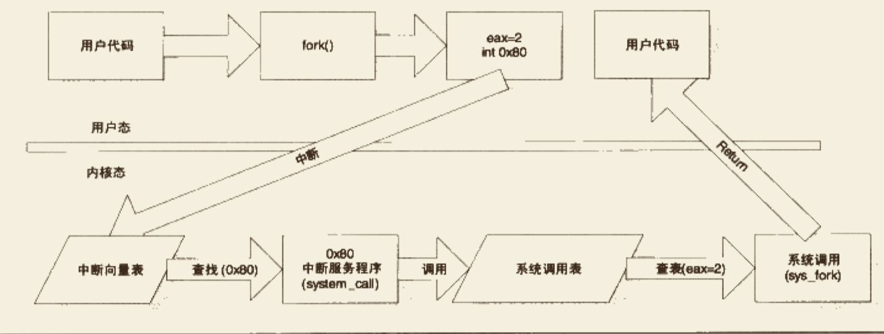
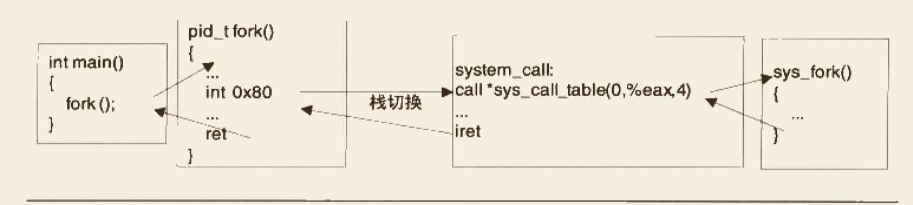

# 系统调用原理

## 1. 特权级与中断

**`用户态`**和**`内核态`**

操作系统一般是通过**`中断`**来从用户态切换到内核态。中断一般具有两个属性，**`中断号`**和**`中断处理程序`**。在内核中，有一个数组称为**`中断向量表`**，这个数组的第n项包含了指向第n号中断的中断处理程序的指针。当中断到来时，CPU会暂停当前执行的代码，根据中断的向量号，在中断向量表中找到对应的中断处理程序并调用它。


中断有两种类型，硬件中断和软件中断。软件中断通常是一条指令（i386下是int），带有一个参数记录中断号，使用这条指令用户可以手动触发某个中断并执行其中断处理程序。在i386下，**`int 0x80`**这条指令会调用第0x80号中断处理程序。

由于中断号有限，操作系统不会用一个中断号对应一个系统调用，而是用一个或几个中断号来对应所有系统调用，再用系统调用号参数来区分具体是哪个系统调用。


## 2. 基于int的Linux经典系统调用实现




### 2.1 第一步 触发中断

程序在代码里调用一个系统调用时，是以一个函数的形式调用的，例如程序调用fork():

```c
int main()
{
		fork();  
}
```

fork()函数是一个对系统调用fork的封装，可以用如下宏来定义它:

```c
_syscall0(pid_t, fork);

// --- i386版本的syscall0定义
#define _syscall0(type, name)		\
type name(void)									\
{																\
long __res;											\
__asm__ volatile ("int $0x80"		\
		: "=a"(__res)								\
		: "0"(__NR_##name));				\
__syscall_return(type, __res);	\
}
```

+   `__asm__`是一个gcc关键字，表示接下来要嵌入汇编代码。`volatile`关键字告诉GCC对这段代码不进行任何优化

+   `__asm__`的第一个参数是一个字符串，代表汇编代码的文本

+   `"=a"(__res)`表示用`eax`输出返回数据并存储在`__res`中

+   `"0"(__NR_##name)`表示`__NR_##name`为输入，`"0"`指示由编译器选择和输出相同的寄存器（即eax）来传递参数

    +   `__NR_##name`是一个宏，对于x86体系结构，该宏的定义在`Linux/include/asm-x86/unistd_32.h`中:

        ```c
        #define __NR_restart_syscall	0
        #define __NR_exit							1
        #define __NR_fork							2
        ...
        ```

+   `__syscall_return`是另一个宏，定义如下:

    ```c
    #define __syscall_return(type, res)			\
    do {																		\
    		if ((unsigned long)(res) >= (unsigned long)(-125)) {	\
    				errno = -(res);									\
    				res = -1;												\
    		}																		\
    		return (type)(res);									\
    } while(0)
    ```

    这个宏用于检查系统调用的返回值，并把它相应地转换为C语言的errno错误码。在Linux中，系统调用使用返回值传递错误码，如果返回值为负数，那么表明调用失败，返回值的绝对值就是错误码。但在glibc中大多数函数都以返回-1表示调用失败，而将出错信息存储在errno全局变量中。`__syscall_return`就是将系统调用结果转换为glibc结果。

+   `如果系统调用本身有参数要如何实现呢？`下面是x86 Linux下的syscall，用于带1个参数的系统调用:

    ```c
    #define _syscall2(type, name, type1, arg1)		\
    type name(type1 arg1)									\
    {																\
    long __res;											\
    __asm__ volatile ("int $0x80"		\
    		: "=a"(__res)								\
    		: "0"(__NR_##name), "b"((long)(arg1)));				\
    __syscall_return(type, __res);	\
    }
    ```

    +   它比`_syscall0`多了一个`"b"((long)(arg1))`，意思是先把arg1强制转换为long，然后存放在ebx中作为输入，编译器会生成相应的代码来保护原来的ebx值不被破坏。
    +   x86下Linux支持的系统调用参数至多有6个，分别使用6个寄存器来传递，它们分别是EBX、ECX、EDX、ESI、EDI、EBP

### 2.2 第二步 切换堆栈

Linux中用户态和内核态使用的是不同堆栈，两者各自负责各自的函数调用，互不干扰。但在系统调用时，程序执行流程从用户态切换内核态，这时程序的当前栈也必须相应地从用户栈切换到内核栈。系统调用返回时，程序的当前栈还要从内核栈切换加用户栈。

将当前栈由用户栈切换为内核栈的实际行为就是:

+   保存当前的ESP、SS值	--- 保存到某个暂时的地方
+   当ESP、SS设置为内核栈的相应值
+   找到当前进程的内核栈（每一个进程都有自己的内核栈）
+   在内核栈中依次压入用户态的寄存器SS、ESP、EFLAGS、CS、EIP
+   系统调用返回时，需要调用iret指令来回到用户态，依次从栈中弹出寄存器信息，切换回用户栈


### 2.3 中断处理程序


#### 2.3.1 中断向量表初始化`trap_init`

>   `arch/x86/kernel/traps_32.c`

>   代码中的函数`set_trap_gate`、`set_intr_gate`、`set_system_gate`、`set_system_intr_gate`等都用于设置某个中断号上的中断处理程序，之所以区分几个名字，是因为i386下对中断有更加细致的划分，这里可以简单认为它们是相同的。

>   可以看到`0x80`对应的中断处理函数是**`system_call`**

```c
void __init trap_init(void)
{
  ...
  set_trap_gate(0,&divide_error);
	set_intr_gate(1,&debug);
	set_intr_gate(2,&nmi);
	set_system_intr_gate(3, &int3); /* int3/4 can be called from all */
	set_system_gate(4,&overflow);
	set_trap_gate(5,&bounds);
	set_trap_gate(6,&invalid_op);
	set_trap_gate(7,&device_not_available);
	set_task_gate(8,GDT_ENTRY_DOUBLEFAULT_TSS);
	set_trap_gate(9,&coprocessor_segment_overrun);
	set_trap_gate(10,&invalid_TSS);
	set_trap_gate(11,&segment_not_present);
	set_trap_gate(12,&stack_segment);
	set_trap_gate(13,&general_protection);
	set_intr_gate(14,&page_fault);
	set_trap_gate(15,&spurious_interrupt_bug);
	set_trap_gate(16,&coprocessor_error);
	set_trap_gate(17,&alignment_check);
  ...
  set_system_gate(SYSCALL_VECTOR,&system_call);
  ...
}
```


#### 2.3.2 system_call

>   arch/x86/kernel/entry_32.S

`main -> fork -> int 0x80 -> system_call`

代码太长，分几部分介绍

+   开头

    ```assembly
    ENTRY(system_call)
            RING0_INT_FRAME                 # can't unwind into user space anyway
            pushl %eax                      # save orig_eax
            CFI_ADJUST_CFA_OFFSET 4
            SAVE_ALL
            GET_THREAD_INFO(%ebp)
                                            # system call tracing in operation / emulation
            /* Note, _TIF_SECCOMP is bit number 8, and so it needs testw and not testb */
    				...
            cmpl $(nr_syscalls), %eax
            jae syscall_badsys
            ...
    ```

    +   开始就使用SAVE_ALL将所有寄存器压栈
    +   比较eax参数值与`nr_syscalls`，`nr_syscalls`是比最大的有效系统调用号大1的值，因此如果eax大于nr_syscalls，表示传入的是无效的参数，跳转到后面的错误处理流程

+   如果系统调用号有效，会继续执行如下:

    ```assembly
    syscall_call:
    	call *sys_call_table(0, %eax, 4)
    	...
    	RESTORE_REGS
    	...
    	iret
    ```

    +   `sys_call_table`定义在`arch/x86/kernel/syscall_table_32.S`

        ```assembly
        ENTRY(sys_call_table)
        	.long sys_restart_syscall	/* 0 - old "setup()" system call, used for restarting */
        	.long sys_exit
        	.long sys_fork
        	.long sys_read
        	.long sys_write
        	.long sys_open		/* 5 */
        	...
        ```

        这是Linux的i386系统调用表，表里的每个元素都是一个系统调用函数的地址。


### 2.4 linux系统调用流程总结




#### 2.4.1 内核里以sys开头的系统调用函数是如何从用户那里获得参数的

用户调用系统调用时，根据系统调用参数数量的不同，依次将参数放入EBX、ECX、EDX、ESI、EDI、EBP这6个寄存器中传递。

进入系统调用的服务程序system_call的时候，system_call调用了一个宏`SAVE_ALL`来保存各个寄存器，因此其内容就是将各个寄存器压入栈中，`SAVE_ALL`的大致内容如下:

>   `arch/x86/kernel/entry_32.S`

```assembly
#define SAVE_ALL \
	cld; \
	pushl %fs; \
	CFI_ADJUST_CFA_OFFSET 4;\
	/*CFI_REL_OFFSET fs, 0;*/\
	pushl %es; \
	CFI_ADJUST_CFA_OFFSET 4;\
	/*CFI_REL_OFFSET es, 0;*/\
	pushl %ds; \
	CFI_ADJUST_CFA_OFFSET 4;\
	/*CFI_REL_OFFSET ds, 0;*/\
	pushl %eax; \
	CFI_ADJUST_CFA_OFFSET 4;\
	CFI_REL_OFFSET eax, 0;\
	pushl %ebp; \
	CFI_ADJUST_CFA_OFFSET 4;\
	CFI_REL_OFFSET ebp, 0;\
	pushl %edi; \
	CFI_ADJUST_CFA_OFFSET 4;\
	CFI_REL_OFFSET edi, 0;\
	pushl %esi; \
	CFI_ADJUST_CFA_OFFSET 4;\
	CFI_REL_OFFSET esi, 0;\
	pushl %edx; \
	CFI_ADJUST_CFA_OFFSET 4;\
	CFI_REL_OFFSET edx, 0;\
	pushl %ecx; \
	CFI_ADJUST_CFA_OFFSET 4;\
	CFI_REL_OFFSET ecx, 0;\
	pushl %ebx; \
	CFI_ADJUST_CFA_OFFSET 4;\
	CFI_REL_OFFSET ebx, 0;\
	movl $(__USER_DS), %edx; \
	movl %edx, %ds; \
	movl %edx, %es; \
	movl $(__KERNEL_PERCPU), %edx; \
	movl %edx, %fs
```


抛开`SAVE_ALL`的最后三条指令不看（这三条指令用于设置内核数据段，不影响栈），可以发现`SAVE_ALL`的一系列`push`指令的最后6条所压入栈中的寄存器恰好就是用来存放系统调用参数的6个寄存器。连顺序都一样，这当然不是一个巧合。

再回到system_call的代码，可以发现在执行`SAVE_ALL`与执行`call *sys_call_table(0, %eax, 4)`之间，没有任何代码会影响到栈。因此刚刚进入sys开头的内核系统调用函数时， 栈上恰好是这样的情形:

 


**另一方面，所有以sys开头的内核系统调用函数，都有一个`asmlinkage`标识，这是一个宏，定义为`__attribute__((regparm(0)))`**。这个扩展关键字的意义是让这个函数只从栈上获取参数，这样一来，内核里的系统调用函数就可以正确地获取用户提供的参数了，整个过程如下图:

 


## 3. Linux的新型系统调用机制

基于`int`指令的系统调用在奔腾4代处理器上性能不佳，Linux在2.5版本起开始支持一种新型的系统调用机制，一组专门针对系统调用的指令：`sysenter/sysexit`

具体暂略....