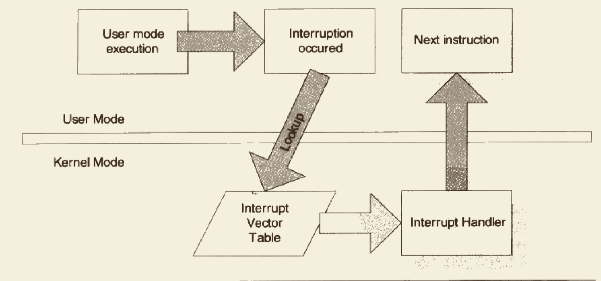

# 系统调用原理

## 1. 特权级与中断

**`用户态`**和**`内核态`**

操作系统一般是通过**`中断`**来从用户态切换到内核态。中断一般具有两个属性，**`中断号`**和**`中断处理程序`**。在内核中，有一个数组称为**`中断向量表`**，这个数组的第n项包含了指向第n号中断的中断处理程序的指针。当中断到来时，CPU会暂停当前执行的代码，根据中断的向量号，在中断向量表中找到对应的中断处理程序并调用它。




中断有两种类型，硬件中断和软件中断。软件中断通常是一条指令（i386下是int），带有一个参数记录中断号，使用这条指令用户可以手动触发某个中断并执行其中断处理程序。在i386下，**`int 0x80`**这条指令会调用第0x80号中断处理程序。

由于中断号有限，操作系统不会用一个中断号对应一个系统调用，而是用一个或几个中断号来对应所有系统调用，再用系统调用号参数来区分具体是哪个系统调用。


## 2. 基于int的Linux经典系统调用实现


+   第一步 触发中断

    程序在代码里调用一个系统调用时，是以一个函数的形式调用的，例如程序调用fork():

    ```c
    int main()
    {
    		fork();  
    }
    ```

    fork()函数是一个对系统调用fork的封装，可以用如下宏来定义它:

    ```c
    _syscall0(pid_t, fork);
    
    // --- i386版本的syscall0定义
    #define _syscall0(type, name)		\
    type name(void)									\
    {																\
    long __res;											\
    __asm__ volatile ("int $0x80"		\
    		: "=a"(__res)								\
    		: "0"(__NR_##name));				\
    __syscall_return(type, __res);	\
    }
    ```

    +   `__asm__`是一个gcc关键字，表示接下来要嵌入汇编代码。`volatile`关键字告诉GCC对这段代码不进行任何优化

    +   `__asm__`的第一个参数是一个字符串，代表汇编代码的文本

    +   `"=a"(__res)`表示用`eax`输出返回数据并存储在`__res`中

    +   `"0"(__NR_##name)`表示`__NR_##name`为输入，`"0"`指示由编译器选择和输出相同的寄存器（即eax）来传递参数

        +   `__NR_##name`是一个宏，对于x86体系结构，该宏的定义在`Linux/include/asm-x86/unistd_32.h`中:

            ```c
            #define __NR_restart_syscall	0
            #define __NR_exit							1
            #define __NR_fork							2
            ...
            ```

    +   `__syscall_return`是另一个宏，定义如下:

        ```c
        #define __syscall_return(type, res)			\
        do {																		\
        		if ((unsigned long)(res) >= (unsigned long)(-125)) {	\
        				errno = -(res);									\
        				res = -1;												\
        		}																		\
        		return (type)(res);									\
        } while(0)
        ```

        这个宏用于检查系统调用的返回值，并把它相应地转换为C语言的errno错误码。在Linux中，系统调用使用返回值传递错误码，如果返回值为负数，那么表明调用失败，返回值的绝对值就是错误码。但在glibc中大多数函数都以返回-1表示调用失败，而将出错信息存储在errno全局变量中。`__syscall_return`就是将系统调用结果转换为glibc结果。

    +   `如果系统调用本身有参数要如何实现呢？`下面是x86 Linux下的syscall，用于带1个参数的系统调用:

        ```c
        #define _syscall2(type, name, type1, arg1)		\
        type name(type1 arg1)									\
        {																\
        long __res;											\
        __asm__ volatile ("int $0x80"		\
        		: "=a"(__res)								\
        		: "0"(__NR_##name), "b"((long)(arg1)));				\
        __syscall_return(type, __res);	\
        }
        ```

        +   它比`_syscall0`多了一个`"b"((long)(arg1))`，意思是先把arg1强制转换为long，然后存放在ebx中作为输入，编译器会生成相应的代码来保护原来的ebx值不被破坏。
        +   x86下Linux支持的系统调用参数至多有6个，分别使用6个寄存器来传递，它们分别是EBX、ECX、EDX、ESI、EDI、EBP

+   第二步 切换堆栈

    Linux中用户态和内核态使用的是不同堆栈，两者各自负责各自的函数调用，互不干扰。但在系统调用时，程序执行流程从用户态切换内核态，这时程序的当前栈也必须相应地从用户栈切换到内核栈。系统调用返回时，程序的当前栈还要从内核栈切换加用户栈。

    将当前栈由用户栈切换为内核栈的实际行为就是:

    +   保存当前的ESP、SS值	--- 保存到某个地址
    +   当ESP、SS设置为内核栈的相应值
    +   找到当前进程的内核栈（每一个进程都有自己的内核栈）
    +   在内核栈中依次压入用户态的寄存器SS、ESP、EFLAGS、CS、EIP
    +   系统调用返回时，需要调用iret指令来回到用户态，依次从栈中弹出寄存器信息，切换回用户栈

    

+   中断处理程序

    

    

    +   中断向量表初始化`trap_init`

        >   `arch/x86/kernel/traps_32.c`

        ```c
        void __init trap_init(void)
        {
          ...
          set_trap_gate(0,&divide_error);
        	set_intr_gate(1,&debug);
        	set_intr_gate(2,&nmi);
        	set_system_intr_gate(3, &int3); /* int3/4 can be called from all */
        	set_system_gate(4,&overflow);
        	set_trap_gate(5,&bounds);
        	set_trap_gate(6,&invalid_op);
        	set_trap_gate(7,&device_not_available);
        	set_task_gate(8,GDT_ENTRY_DOUBLEFAULT_TSS);
        	set_trap_gate(9,&coprocessor_segment_overrun);
        	set_trap_gate(10,&invalid_TSS);
        	set_trap_gate(11,&segment_not_present);
        	set_trap_gate(12,&stack_segment);
        	set_trap_gate(13,&general_protection);
        	set_intr_gate(14,&page_fault);
        	set_trap_gate(15,&spurious_interrupt_bug);
        	set_trap_gate(16,&coprocessor_error);
        	set_trap_gate(17,&alignment_check);
          ...
          set_system_gate(SYSCALL_VECTOR,&system_call);
          ...
        }
        ```

        +   可以看到`0x80`对应的中断处理函数是**`system_call`**